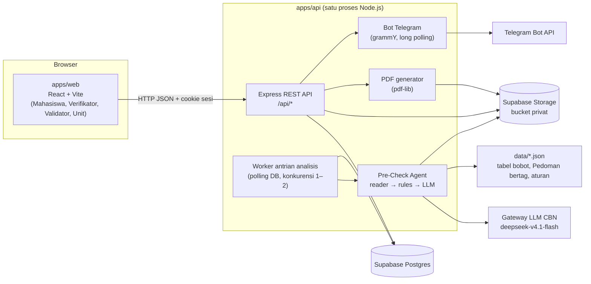
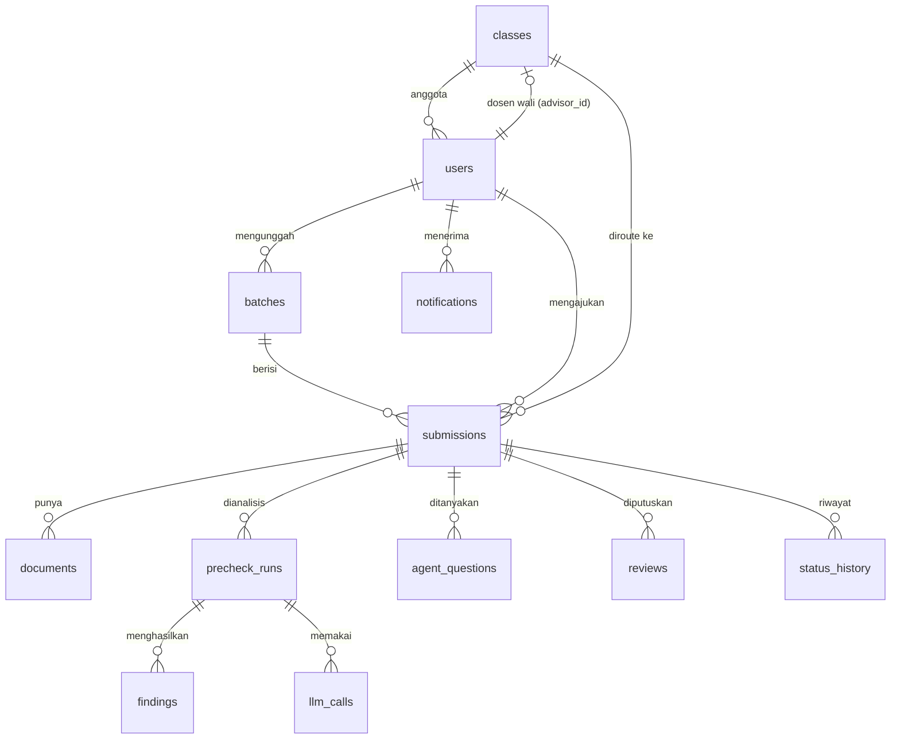
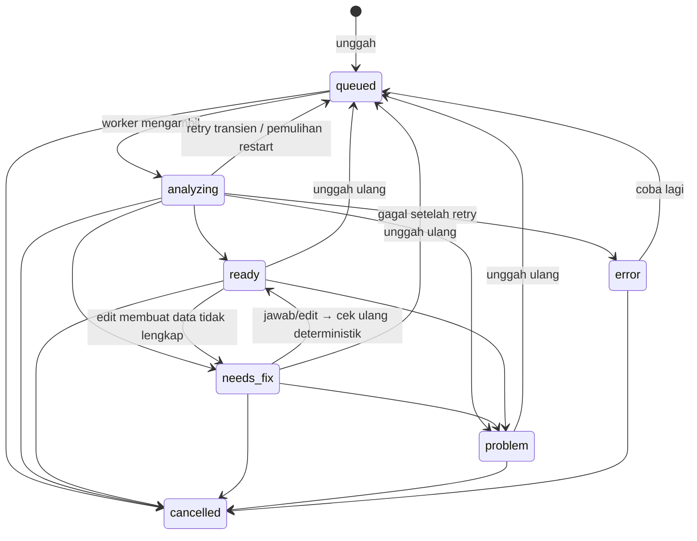
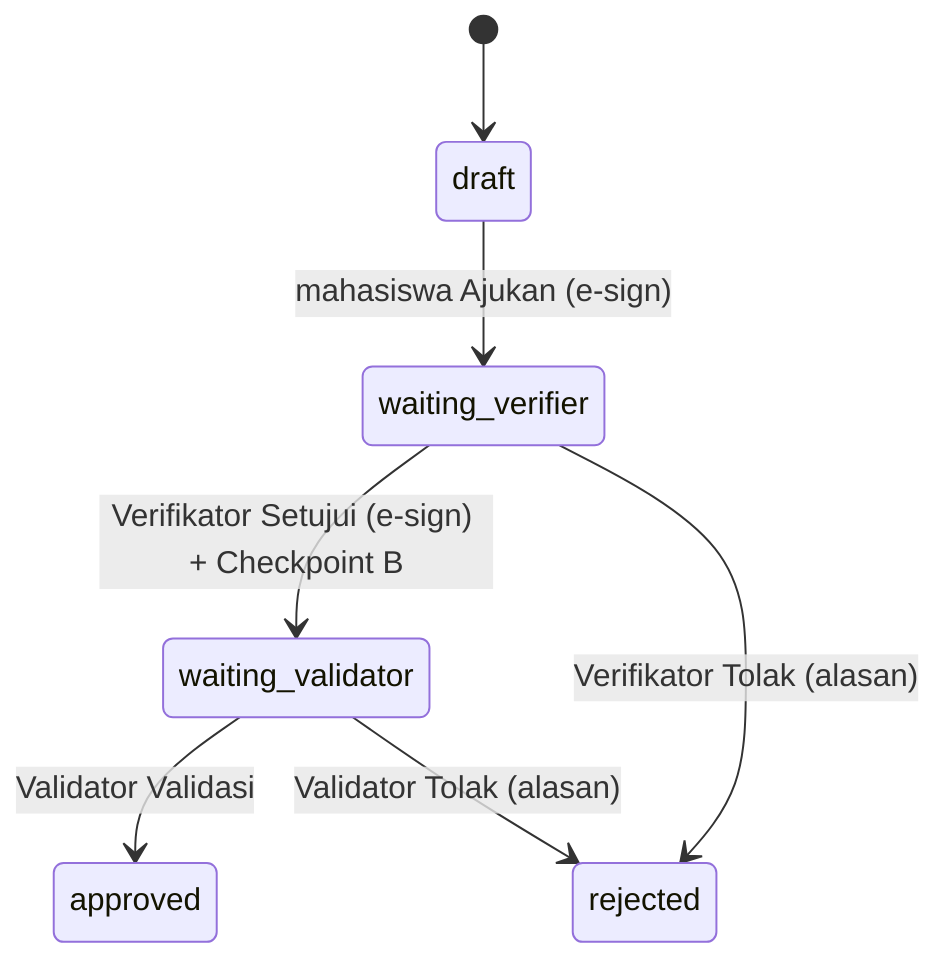
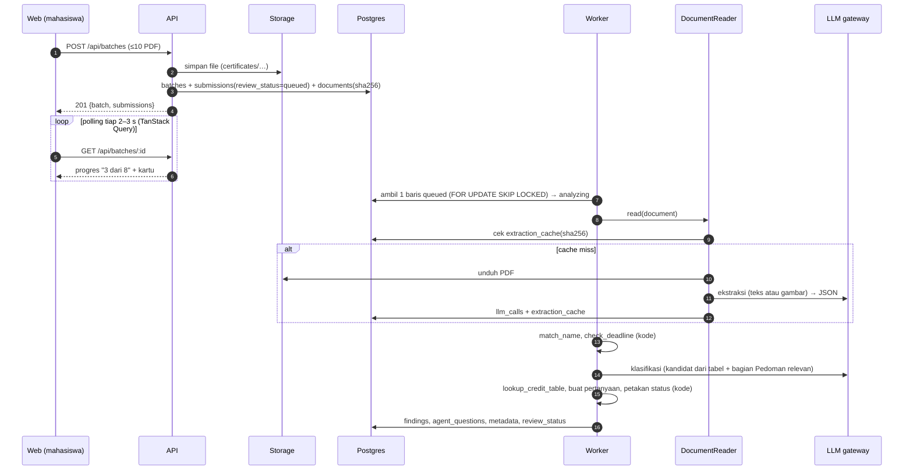

# ARCHITECTURE — SKEM AI Co-Pilot

Acuan teknis untuk developer dan AI agent. Acuan produk: [`docs/PRD.md`](docs/PRD.md) (v0.11). Aturan kerja agent: [`AGENTS.md`](AGENTS.md). Kontrak endpoint rinci: [`docs/API.md`](docs/API.md).

Nilai enum, nama tabel, dan nama endpoint di dokumen ini **mengikat**. Jika perlu diubah, ubah di sini, `packages/shared`, dan `docs/API.md` dalam PR yang sama.

---

## 1. Gambaran sistem



- Browser **tidak pernah** mengakses Supabase langsung. Service key hanya ada di `apps/api`.
- Worker berjalan di proses yang sama dengan API (tidak ada Redis/queue eksternal).
- Tabel bobot, Pedoman bertag, dan aturan tanggal adalah **file JSON di repo**, bukan tabel DB.

## 2. Struktur monorepo

npm workspaces. Node.js ≥ 22. TypeScript strict di semua paket.

```
.
├─ apps/
│  ├─ web/                    # @skem/web — Vite + React + React Router + TanStack Query
│  │  └─ src/
│  │     ├─ routes/           # student/, verifier/, validator/, unit/, login
│  │     ├─ components/       # kartu, tabel, timeline, lencana, modal e-sign, dsb.
│  │     ├─ api/              # klien fetch + hooks TanStack Query (tipe dari @skem/shared)
│  │     └─ lib/
│  └─ api/                    # @skem/api — Express
│     ├─ src/
│     │  ├─ index.ts          # bootstrap: env, app, worker, bot
│     │  ├─ env.ts            # zod schema untuk process.env
│     │  ├─ routes/           # auth, me, batches, submissions, verifier, validator, notifications, unit, health
│     │  ├─ middleware/       # auth (sesi mock), requireRole, requireClassAccess, upload, error
│     │  ├─ services/         # logika use-case: submissions, reviews, signatures, storage, notifications
│     │  ├─ agent/            # orkestrasi pre-check, pertanyaan, pemetaan status, prompt
│     │  ├─ rules/            # FUNGSI MURNI: credit, deadline, name-match, guideline, status-mapper
│     │  ├─ llm/              # satu-satunya klien LLM + pencatatan llm_calls
│     │  ├─ reader/           # DocumentReader + strategi text/vision + render + cache
│     │  ├─ pdf/              # formulir final FM.MHS.PENGAJUANSKEM
│     │  ├─ queue/            # worker analisis
│     │  ├─ telegram/         # bot (Should have)
│     │  └─ db/               # schema.ts (Drizzle), client.ts, seed.ts, migrations/
│     └─ test/
├─ packages/
│  └─ shared/                 # @skem/shared — enum, zod schema API/LLM, tipe bersama
├─ data/
│  ├─ credit_table.json       # tabel bobot (Lampiran Pedoman)
│  ├─ guideline_sections.json # Pedoman dipecah per bagian + tag
│  ├─ rules.json              # aturan tanggal, ambang nama, ambang confidence, batas
│  ├─ seed/                   # data dummy kelas & pengguna (Simulasi)
│  └─ testset/                # cases/*.pdf + answer_key.json (split tuning/heldout)
├─ scripts/                   # eval.ts, validate-data.ts
└─ docs/                      # PRD, API, ui-spec (layar), design-prompts, rencana kerja
```

Aturan ketergantungan: `web → shared`, `api → shared`, `api/rules` tidak mengimpor `db`, `llm`, atau Express (murni, mudah dites). `agent` memanggil `reader`, `rules`, `llm`.

## 3. Model data (Postgres, Drizzle)

Semua kolom waktu `timestamptz` default `now()`. Uang/kredit `numeric(4,2)` (dikonversi ke `number` di batas API). Nama tabel dan kolom `snake_case`.

### 3.1 Enum Postgres (nilai dikunci di `packages/shared/src/enums.ts`)

| Enum | Nilai |
|---|---|
| `user_role` | `student`, `verifier`, `validator`, `unit` |
| `review_status` | `queued`, `analyzing`, `ready`, `needs_fix`, `problem`, `error`, `cancelled` |
| `submission_status` | `draft`, `waiting_verifier`, `waiting_validator`, `approved`, `rejected` |
| `run_status` | `running`, `done`, `failed` |
| `reader_strategy` | `text`, `vision`, `ocr`, `cache` |
| `check_type` | `category`, `level`, `role`, `activity_name`, `name_match`, `deadline`, `completeness`, `credit` |
| `finding_result` | `pass`, `warn`, `fail` |
| `document_type` | `certificate`, `supporting` |
| `review_stage` | `verifier`, `validator` |
| `review_decision` | `approve`, `reject`, `adjust_credit` |
| `final_form_status` | `none`, `ready`, `failed` |
| `notification_channel` | `in_app`, `telegram` |
| `notification_status` | `pending`, `sent`, `failed` |

Catatan terhadap ERD PRD §10: `check_type` `name` diganti `activity_name` (agar tidak tertukar dengan `name_match`) dan ditambah `credit` (kombinasi tidak ada di tabel). `document_type` `signed_form` dihapus (tidak ada unggah formulir bertanda tangan sejak v0.8). `review_decision` ditambah `adjust_credit` untuk riwayat perubahan kredit final oleh Validator.

Enum non-DB di `shared`: `PARTICIPANT_SCOPE` = `campus | regional | national | international` (jawaban pertanyaan cakupan peserta), `OFFICIAL_STATUS` = `dalam_proses | disetujui | ditolak`.

### 3.2 Tabel



| Tabel | Kolom penting | Batasan & indeks |
|---|---|---|
| `classes` | `id`, `name`, `advisor_id → users` (Verifikator) | `name` unik |
| `users` | `id`, `name`, `nrp`, `role user_role`, `angkatan int`, `program_studi`, `departemen`, `jabatan` (Verifikator), `class_id → classes`, `signature_path`, `telegram_chat_id`, `telegram_link_token` | `nrp` unik (nullable), indeks `class_id` |
| `batches` | `id`, `public_id`, `student_id`, `file_count`, `created_at` | `public_id` unik, `CHECK file_count BETWEEN 1 AND 10` |
| `submissions` | `id`, `public_id`, `batch_id`, `student_id`, `class_id`, `status submission_status` (default `draft`), `review_status review_status` (default `queued`), `activity_name`, `activity_date date` (**tanggal selesai**), `location_platform`, `organizer`, `attachment_type`, `komponen int`, `category_code`, `level`, `role_in_activity`, `achievement`, `credit_entry_id`, `estimated_credit numeric`, `final_credit numeric`, `warnings jsonb` (default `[]`), `final_form_path`, `final_form_status`, `attempts int`, `locked_at`, `next_attempt_at`, `last_error`, `submitted_at`, `created_at`, `updated_at` | `public_id` unik (format `SKM-XXXXXXXX`); indeks parsial `(created_at) WHERE review_status='queued'`; indeks `(class_id, status)`, `(student_id, status)`, `(batch_id)` |
| `documents` | `id`, `submission_id`, `type document_type`, `file_path`, `file_name`, `mime`, `size_bytes`, `sha256`, `page_count` | indeks `sha256`, `submission_id` |
| `precheck_runs` | `id`, `submission_id`, `attempt`, `model`, `reader_strategy`, `status run_status`, `extracted jsonb` (hasil baca AI **asli**, untuk evaluasi), `classification jsonb`, `error`, `started_at`, `finished_at` | indeks `submission_id` |
| `findings` | `id`, `run_id`, `check_type`, `result finding_result`, `confidence real`, `guideline_ref` (id bagian Pedoman), `message`, `data jsonb` | indeks `run_id` |
| `agent_questions` | `id`, `submission_id`, `run_id`, `seq`, `field` (`level`/`category`/`role`/`achievement`/`activity_date`/…), `question`, `options jsonb`, `answer`, `answered_at` | unik `(submission_id, seq)`, `CHECK seq BETWEEN 1 AND 3` |
| `llm_calls` | `id`, `run_id`, `submission_id`, `purpose`, `model`, `prompt_version`, `prompt_tokens`, `completion_tokens`, `total_tokens`, `latency_ms`, `cache_hit bool`, `error`, `created_at` | indeks `submission_id`, `created_at` |
| `extraction_cache` | `sha256`, `reader_version`, `model`, `result jsonb`, `created_at` | PK `(sha256, reader_version)` |
| `reviews` | `id`, `submission_id`, `reviewer_id`, `stage review_stage`, `decision review_decision`, `note`, `previous_credit`, `adjusted_credit`, `adjust_reason`, `signature_applied bool`, `created_at` | `CHECK (decision <> 'reject' OR length(trim(note)) > 0)`; `CHECK (adjusted_credit IS NULL OR length(trim(adjust_reason)) > 0)` |
| `status_history` | `id`, `submission_id`, `field` (`status`/`review_status`), `from_value`, `to_value`, `changed_by → users` (NULL = sistem), `note`, `created_at` | indeks `(submission_id, created_at)` |
| `notifications` | `id`, `user_id`, `submission_id`, `channel`, `trigger_review_id → reviews`, `title`, `body`, `status notification_status`, `read_at`, `created_at` | indeks `(user_id, read_at)` |

Aturan data:
- `final_credit` diisi saat Validator memvalidasi (default = `estimated_credit`).
- `credit_entry_id` menunjuk tepat satu `id` di `data/credit_table.json` → setiap estimasi dapat ditelusuri (acceptance FR-1).
- Hasil baca AI asli hanya di `precheck_runs.extracted`; tidak pernah ditampilkan sebagai penanda "diubah".
- `llm_calls` **tidak menyimpan isi prompt atau respons** (hanya angka dan metadata), sehingga nama/NRP tidak masuk log.

## 4. State machine

### 4.1 `review_status` (hasil analisis AI, selama `status = draft`)



| Transisi | Pemicu (peran) | Syarat | Efek samping |
|---|---|---|---|
| `queued → analyzing` | worker | baris dikunci (`SKIP LOCKED`) | `attempts+1`, `locked_at=now()`, buat `precheck_runs(running)` |
| `analyzing → ready/needs_fix/problem` | worker | run selesai | tulis `findings`, `agent_questions`, metadata, `estimated_credit`, `credit_entry_id`, `warnings`; run `done` |
| `analyzing → queued` | worker | error transien & `attempts < 3` | `next_attempt_at = now() + 5s × 2^attempts` |
| `analyzing → error` | worker | error permanen atau `attempts ≥ 3` | `last_error`, run `failed` |
| `needs_fix/ready → ready/needs_fix/problem` | mahasiswa (pemilik) | `status=draft` | **jalankan ulang aturan deterministik tanpa LLM**; tulis findings run terbaru |
| `* → queued` (unggah ulang) | mahasiswa | `status=draft`, bukan `analyzing` | ganti dokumen, reset metadata & pertanyaan, `attempts=0` |
| `error → queued` (coba lagi) | mahasiswa | — | `attempts=0` |
| `* → cancelled` | mahasiswa | `status=draft` | hapus file dari Storage; jika `analyzing`, worker membuang hasilnya |

Pemetaan status hasil (di `rules/status-mapper.ts`, fungsi murni):
- `problem`: `name_match = fail` (jelas orang lain), `deadline = fail` (di luar rentang/masa depan), atau dokumen bukan bukti kegiatan.
- `needs_fix`: ada `agent_questions` belum dijawab, field wajib kosong/confidence < ambang, atau `credit = fail` (kombinasi tidak ada di tabel → pesan arahkan ke Unit Kemahasiswaan).
- `ready`: selain itu. `warn` (mis. ejaan nama berbeda, nama kegiatan tampak singkatan) tetap `ready` dan masuk `warnings`.

### 4.2 `status` (siklus pengajuan)



| Transisi | Peran | Syarat | Efek samping |
|---|---|---|---|
| `draft → waiting_verifier` | `student` pemilik | `review_status=ready`, tanda tangan tersimpan | `submitted_at`, bagian IV terisi (tanda tangan mahasiswa), `status_history`, notifikasi in-app ke Verifikator kelas |
| `waiting_verifier → waiting_validator` | `verifier` dengan `class_id` sama | tanda tangan Verifikator tersimpan | `reviews(approve, signature_applied=true)`, Checkpoint B: buat PDF final (gagal → `final_form_status=failed`, tetap lanjut), `status_history`, notifikasi ke mahasiswa |
| `waiting_verifier → rejected` | `verifier` kelas sama | `note` tidak kosong (UI **dan** API) | `reviews(reject)`, notifikasi |
| `waiting_validator → approved` | `validator` | — | `final_credit` = nilai terakhir (estimasi atau hasil `adjust_credit`), `reviews(approve)`, notifikasi |
| `waiting_validator → rejected` | `validator` | `note` tidak kosong | `reviews(reject)`, notifikasi |
| ubah kredit final | `validator` | `status=waiting_validator`, `adjust_reason` tidak kosong, nilai berbeda | `reviews(adjust_credit, previous_credit, adjusted_credit, adjust_reason)` |

Tidak ada transisi balik ke `draft`. Pengajuan yang ditolak diajukan ulang sebagai pengajuan baru. Pemetaan ke status resmi: `waiting_*` → `dalam_proses`, `approved` → `disetujui`, `rejected` → `ditolak`.

## 5. Alur data utama



## 6. Antrian analisis (`apps/api/src/queue/worker.ts`)

- Worker mulai bersama server; `setInterval` 2 s; konkurensi `worker.concurrency` di `data/rules.json` (default 1, maks 2; percobaan maks. `worker.maxAttempts`).
- Klaim pekerjaan dalam satu transaksi:
  ```sql
  UPDATE submissions SET review_status='analyzing', locked_at=now(), attempts=attempts+1
  WHERE id = (SELECT id FROM submissions
              WHERE review_status='queued' AND (next_attempt_at IS NULL OR next_attempt_at <= now())
              ORDER BY created_at FOR UPDATE SKIP LOCKED LIMIT 1)
  RETURNING *;
  ```
- **Idempoten**: setiap percobaan membuat `precheck_runs` baru; tampilan memakai run terbaru. Sebelum menulis hasil, worker memeriksa ulang bahwa baris masih `analyzing` (bisa sudah `cancelled`).
- **Retry**: error transien (timeout, 429, 5xx, JSON invalid setelah perbaikan) → kembali `queued` dengan backoff; maks 3 percobaan → `error`. Error permanen (PDF rusak, bukan PDF) → langsung `error`.
- **Pemulihan restart**: saat start, baris `analyzing` dengan `locked_at` > 5 menit dikembalikan ke `queued`.
- Satu kartu `needs_fix` tidak memblokir kartu lain karena pertanyaan diselesaikan di luar worker.
- Koneksi DB: `postgres` (postgres-js). Jika memakai pooler transaksi Supabase (port 6543), set `prepare: false`; untuk worker lebih aman pakai session pooler/port 5432.

## 7. DocumentReader (`apps/api/src/reader/`)

`deepseek-v4.1-flash` **sudah dikonfirmasi bisa membaca gambar** (jawaban tim). OCR tidak diimplementasikan; slot strategi disediakan agar bisa ditambah.

```ts
interface DocumentReader {
  read(input: { sha256: string; pdf: Buffer }, ctx: { submissionId: number; runId: number }):
    Promise<{ strategy: 'text' | 'vision' | 'cache'; fields: ExtractedFields }>;
}
```

Pohon keputusan:
1. **Cache**: `extraction_cache(sha256, READER_VERSION)` ada → pakai, catat `strategy='cache'`, tidak memanggil LLM.
2. **Teks**: ambil lapisan teks halaman 1–2 (mis. `unpdf`). Jika teks ≥ 200 karakter bermakna → kirim **teks** ke LLM untuk ekstraksi (murah).
3. **Vision**: jika teks kurang, atau field wajib (`recipient_name`, `activity_name`) tidak ditemukan dari teks → render halaman 1 (maks. 2) ke PNG, perkecil sisi terpanjang ≤ 1280 px (`sharp`), kirim sebagai `image_url` base64.
4. `ocr` — tidak dipakai (cadangan masa depan).

Batasan: hanya `application/pdf` (cek magic bytes `%PDF`), maks. 10 MB per file, maks. 2 halaman dikirim ke model. Pustaka render PDF dipilih di issue reader (kandidat: `mupdf` WASM atau `pdf-to-img`); catat di `tech.md`.

`ExtractedFields` (zod di `shared`): `document_kind` (`certificate | decree | other`), `recipient_name`, `activity_name`, `activity_start_date`, `activity_end_date`, `organizer`, `location_platform`, `role_text`, `achievement_text`, `participant_scope_text`, masing-masing `{ value, confidence }`.

## 8. Kontrak tool agent (`apps/api/src/agent/`)

Agent adalah **orkestrasi tetap** (bukan loop tool-calling bebas): urutan tool ditentukan kode, LLM hanya dipanggil untuk ekstraksi dan klasifikasi. Alasannya: maksimal 2 panggilan LLM per kartu, hasil dapat diuji, dan efisiensi token (15% penilaian). Semua masukan/keluaran divalidasi zod.

| Tool | Jenis | Masuk | Keluar |
|---|---|---|---|
| `read_document` | LLM (via reader) | `{ sha256, pdf }` | `ExtractedFields` |
| `match_name` | murni | `{ certificateName, accountName }` | `{ result: 'pass'|'warn'|'fail', score: number }` |
| `check_deadline` | murni | `{ activityEndDate, angkatan, submissionDate }` | `{ result, validFrom, validTo, message }` |
| `get_relevant_sections` | murni | `{ tags: string[], categoryCode?: string }` | `{ sections: { id, title, ref, text }[] }`, maks. 3 bagian dan ≤ 1.500 karakter; skor = tag cocok + kecocokan `categoryCodes` (detail: `data/guideline_sections.NOTES.md`) |
| `classify_activity` | LLM | `{ fields, candidates, sections }` | `{ category: Cand[], level: Cand[], role: Cand[], achievement: Cand[], activity_name_full?: {value, confidence}, missing: string[] }` dengan `Cand = { code, confidence }`, top-3 |
| `lookup_credit_table` | murni | `{ komponen, categoryCode, level, role, achievement? }` | `{ found: true, entryId, credit, ref } | { found: false, reason }` |
| `ask_student` | murni (templat) | `{ field, context }` | `{ field, question, options }` |

Aturan:
- **LLM tidak pernah mengeluarkan angka kredit.** Skema keluaran LLM tidak punya field kredit; `lookup_credit_table` satu-satunya sumber.
- `classify_activity` hanya boleh memilih `code` dari `candidates` (diambil dari `credit_table.json`); kode di luar daftar = invalid.
- Pertanyaan dari **templat kode**, maks. 3 per kartu (`CHECK seq ≤ 3`). Pertanyaan tingkat selalu berupa pilihan cakupan peserta (`PARTICIPANT_SCOPE` + "Saya tidak tahu"). Jawaban dipetakan ke field lalu aturan deterministik dijalankan ulang **tanpa LLM**.
- Panggilan LLM: `temperature: 0`, `response_format: { type: 'json_object' }`, timeout 45 s. JSON invalid → satu kali percobaan perbaikan (kirim error zod, minta JSON saja); gagal lagi → error transien (retry antrian).
- Ambang (`data/rules.json`): `confidenceThreshold` awal 0,7; `nameMatch.warnMin` 0,8. `match_name`: `pass` = sama persis setelah normalisasi (gelar, aksen, tanda baca, kapital); selain itu skor = rata-rata Jaro-Winkler per kata (setiap kata nama yang lebih pendek dipasangkan dengan kata paling mirip; inisial "M." cocok "Muhammad"), skor ≥ 0,8 → `warn`, di bawahnya → `fail`. Skor per kata dipilih daripada Jaro-Winkler string utuh agar nama depan yang sama ("Muhammad Ilham" vs "Muhammad Rizki") tidak lolos sebagai `warn`.
- Aturan tanggal (`data/rules.json` → `dateRules`): angkatan < `minAngkatan` (2024) → `fail` ("SKEM berlaku untuk angkatan 2024 dan setelahnya"); angkatan 2024 → `activity_end_date ≥ angkatan2024MinDate` (2024-01-01); angkatan ≥ 2025 → `[submissionDate − angkatan2025PlusWindowYears, submissionDate]` inklusif (29 Feb → 28 Feb); tanggal masa depan selalu `fail`. Di dalam rentang tetapi sebelum perkiraan awal masa studi (`{angkatan}-{studyStartMonthDay}`, default 1 Agustus) → `warn`, bukan `fail` (Ketentuan Umum SKEM poin 8; keputusan tim). `submissionDate` = hari ini saat analisis/cek ulang, selalu diteruskan sebagai argumen `today`.

Catatan domain untuk `credit_table.json` (182 baris; rincian di `data/credit_table.NOTES.md`): kolom "Tingkat" di Lampiran tidak selalu cakupan peserta (ada "Program Studi (Hima)", "UKM / Tim Kompetisi", "Lanjut/Menengah", "Perseroan Terbatas (PT)", dll.). Karena itu `level` adalah string per baris, sedangkan pertanyaan cakupan peserta hanya dipakai untuk baris bertingkat Internasional/Nasional/Regional/Kampus. `level` dan `role` bernilai `null` bila kolomnya kosong di tabel (Komponen 1–2 tanpa tingkat; bidang D tanpa tingkat dan jabatan), dan `bidang` (`A`–`D`) hanya diisi untuk Komponen 3. `lookup_credit_table` harus mencocokkan `null` secara eksplisit, bukan sebagai wildcard.

## 9. API

Prefix `/api`. JSON, kecuali unggahan (`multipart/form-data`). Detail request/response di [`docs/API.md`](docs/API.md).

| Metode | Path | Peran | Ringkas |
|---|---|---|---|
| GET | `/health` | publik | status server, DB |
| GET | `/auth/mock-users` | publik | daftar akun seed untuk pemilih peran (Simulasi) |
| POST | `/auth/mock-login` | publik | `{ userId }` → cookie sesi |
| POST | `/auth/logout` | semua | hapus sesi |
| GET | `/me` | semua | profil, kelas, dosen wali, `hasSignature`, `telegramLinked` |
| PUT | `/me/signature` | student, verifier | simpan/ganti PNG ≤ 1 MB di bucket privat (`multipart file` atau `dataUrl`) |
| GET | `/me/signature` | student, verifier | gambar tanda tangan **milik sendiri**, tanpa signed URL |
| GET | `/me/progress` | student | jumlah `final_credit` dari pengajuan `approved`, per komponen menuju 3,0 |
| POST | `/batches` | student | unggah 1–10 PDF |
| GET | `/batches/:publicId` | student pemilik | progres + kartu |
| GET | `/submissions` | student | daftar pengajuan sendiri |
| GET | `/submissions/:publicId` | pemilik, verifier kelasnya, validator, unit | detail; metadata kegiatan/SKEM boleh `null` selama pre-check belum lengkap |
| PATCH | `/submissions/:publicId` | student pemilik | edit metadata kegiatan/SKEM nullable → cek ulang deterministik tanpa LLM; identitas ditolak; konflik saat `queued`/`analyzing`/`cancelled` |
| POST | `/submissions/:publicId/answers` | student pemilik | jawab pertanyaan agent; opsi harus cocok; teks bebas hanya untuk `activity_name`, `activity_date` wajib `YYYY-MM-DD`; konflik saat `queued`/`analyzing`/`cancelled` |
| POST | `/submissions/:publicId/cancel` | student pemilik | batalkan kartu |
| POST | `/submissions/:publicId/reupload` | student pemilik | ganti file → antre ulang |
| POST | `/submissions/:publicId/retry` | student pemilik | coba lagi (dari `error`) |
| POST | `/submissions/submit` | student | `{ publicIds }` ajukan satu/banyak yang `ready`; wajib tanda tangan; transaksi status/history + notifikasi in-app Verifikator |
| GET | `/submissions/:publicId/certificate` | pemilik, verifier kelasnya, validator | signed URL bukti (TTL 60 s) |
| GET | `/submissions/:publicId/final-form` | pemilik, verifier kelasnya, validator | signed URL PDF final |
| GET | `/verifier/queue` | verifier | antrian kelasnya (`waiting_verifier`); filter `aiStatus=clean\|warning`, urut `oldest\|newest\|flags` |
| POST | `/verifier/submissions/:publicId/approve` | verifier kelasnya | Setujui (+e-sign tersimpan, 409 `SIGNATURE_REQUIRED`); hook `onVerifierApproved` setelah commit |
| POST | `/verifier/submissions/:publicId/reject` | verifier kelasnya | Tolak `{ note }` wajib (zod + CHECK DB) |
| GET | `/validator/queue` | validator | antrian lintas kelas (`waiting_validator`), filter `classId`, + `finalFormStatus` |
| POST | `/validator/submissions/:publicId/credit` | validator | ubah kredit final `{ finalCredit (0–3, 2 desimal), reason }`; nilai sama → 400 |
| POST | `/validator/submissions/:publicId/validate` | validator | Validasi; `final_credit` = hasil `/credit` terakhir atau estimasi |
| POST | `/validator/submissions/:publicId/reject` | validator | Tolak `{ note }` wajib |
| POST | `/validator/submissions/:publicId/regenerate-form` | validator | buat ulang PDF final |
| GET | `/notifications` | semua | notifikasi in-app |
| POST | `/notifications/:id/read` | pemilik | tandai dibaca |
| POST | `/me/telegram/link` | student, verifier | deep link `t.me/<bot>?start=<token>` |
| GET | `/unit/summary` | unit, validator | rekap per status/kelas/jenis temuan (Could) |
| GET | `/stats/tokens` | validator, unit | ringkasan pemakaian token |

Format error seragam (semua 4xx/5xx):

```json
{ "error": { "code": "VALIDATION_ERROR", "message": "Alasan penolakan wajib diisi.", "details": {} } }
```

Kode: `VALIDATION_ERROR` 400, `UNAUTHENTICATED` 401, `FORBIDDEN` 403, `NOT_FOUND` 404 (juga dipakai untuk pengajuan kelas lain agar tidak membocorkan keberadaan), `CONFLICT` 409 (transisi status tidak sah), `PAYLOAD_TOO_LARGE` 413, `UNSUPPORTED_MEDIA_TYPE` 415, `INTERNAL` 500. Kode khusus domain: `TOO_MANY_FILES` 400, `SIGNATURE_REQUIRED` 409, `INVALID_TRANSITION` 409. Daftar lengkap dikunci di `packages/shared` (L-03).

## 10. Keamanan dan akses

- `SUPABASE_SERVICE_ROLE_KEY`, `LLM_API_KEY`, `TELEGRAM_BOT_TOKEN` hanya di `.env` server; divalidasi `env.ts`; tidak pernah dikirim ke browser atau di-log.
- Sesi mock: cookie `httpOnly`, `sameSite=lax`, ditandatangani `SESSION_SECRET`, berisi `userId`. UI dan README menandai login sebagai **Simulasi**.
- Middleware: `requireAuth` → `requireRole(...roles)` → `loadSubmission` + `assertAccess` (pemilik / verifier dengan `class_id` sama / validator / unit baca-saja). Akses ditolak ke kelas lain → `404`.
- Verifikator tidak punya endpoint tulis selain approve/reject. Hanya `validator` yang bisa memanggil `/credit`.
- Bucket Storage privat. Bukti dan PDF final: signed URL TTL 60 s setelah cek akses. **Tanda tangan**: tidak ada signed URL; hanya dibaca server untuk membuat PDF, dan `GET /me/signature` hanya mengembalikan milik sendiri. Setiap pembubuhan tercatat (`status_history` untuk mahasiswa, `reviews.signature_applied` untuk Verifikator).
- Unggahan: `multer` memory storage, hanya PDF (magic bytes), ≤ 10 MB/file, ≤ 10 file/request. Tanda tangan: PNG ≤ 1 MB.
- Data dummy saja. Nama/NRP tidak ditulis ke log konsol atau `llm_calls`.

## 11. Observabilitas token

- Satu wrapper: `apps/api/src/llm/client.ts` → `callLlm({ purpose, submissionId, runId, messages, schema, promptVersion })`. Tidak ada `fetch`/SDK LLM di tempat lain.
- Setiap panggilan (termasuk gagal) menulis `llm_calls` dengan token dari `usage` respons, latensi, `cache_hit` (true jika hasil dari `extraction_cache`, token 0).
- `purpose`: `extract_text`, `extract_vision`, `extract_repair`, `classify`, `classify_repair`.
- Ringkasan per pengajuan ada di `GET /submissions/:publicId` (`tokenUsage`), total di `GET /stats/tokens`.
- Mengukur optimasi: jalankan `npm run eval` dengan konfigurasi baseline (mis. `--no-cache --sections=all --image-max=2048`) dan teroptimasi; skrip mencetak token rata-rata per kasus **dan** akurasi pada split yang sama. Hasil disalin ke README §7.

## 12. Pengujian dan evaluasi

| Lapisan | Alat | Cakupan wajib |
|---|---|---|
| Unit | Vitest | `rules/*` (credit, deadline per angkatan & batas tanggal, name-match, status-mapper, guideline), validasi `data/*.json` |
| Integrasi API | Vitest + Supertest | guard peran/kelas, tolak tanpa alasan → 400, transisi status sah/tidak sah → 409, upload > 10 file → 400 |
| Eval | `npm run eval` (`scripts/eval.ts`) | membaca `data/testset/answer_key.json`, menjalankan pipeline nyata ke gateway, mencetak akurasi per jenis kesalahan, kategori/tingkat (top-1, top-3), kredit, status, dan token per kasus |

`answer_key.json`: `{ "cases": [{ "id", "file", "split": "tuning" | "heldout", "account": {name, angkatan}, "expected": { "review_status", "category_code", "level", "role", "credit_entry_id", "errors": [] } }] }`. Angka akhir di README **hanya** dari `--split=heldout`. Tes unit tidak memanggil LLM (pakai fixture).

## 13. Konfigurasi dan menjalankan lokal

```bash
npm install
cp .env.example .env        # isi kunci dari kanal privat tim
npm run db:migrate          # terapkan migrasi Drizzle ke Supabase
npm run seed                # kelas & akun dummy (Simulasi)
npm run dev                 # API :3000 + web :5173 (proxy /api → :3000)
```

Perintah lain: `npm test`, `npm run lint`, `npm run typecheck`, `npm run db:generate`, `npm run data:validate`, `npm run eval [-- --split=heldout]`, `npm run build`. Daftar ini harus sama dengan `package.json` (dibuat issue L-01).

## 14. Risiko teknis dan mitigasi

| Risiko | Mitigasi |
|---|---|
| Pembacaan foto/scan buruk | Strategi vision, field confidence rendah → `needs_fix`, test set berisi foto HP |
| JSON LLM invalid | zod + satu kali perbaikan + retry antrian; status `error` dengan Coba lagi |
| Rate limit / gateway lambat saat demo | Konkurensi 1–2, backoff, cache per hash, siapkan video cadangan |
| Token 10 juta habis | Teks lebih dulu, gambar diperkecil, bagian Pedoman relevan saja, cache, eval parsial saat menyetel; pantau `/stats/tokens` |
| Kombinasi tidak ada di tabel | `credit = fail` → pesan jelas, tidak menebak |
| Restart server di tengah antrian | Pemulihan `locked_at` kedaluwarsa |
| Pengajuan ganda | `public_id` unik, transisi dicek di transaksi (`WHERE status = 'draft'`) → 409 |
| Pembuatan PDF final gagal | `final_form_status=failed`, tetap masuk antrian Validator, tombol Buat ulang |
| Salah rute kelas | `class_id` diambil dari profil mahasiswa saat unggah, bukan dari klien |
| Kebocoran kunci | `.env` di `.gitignore`, audit `git grep` sebelum submit, CI tanpa rahasia |
