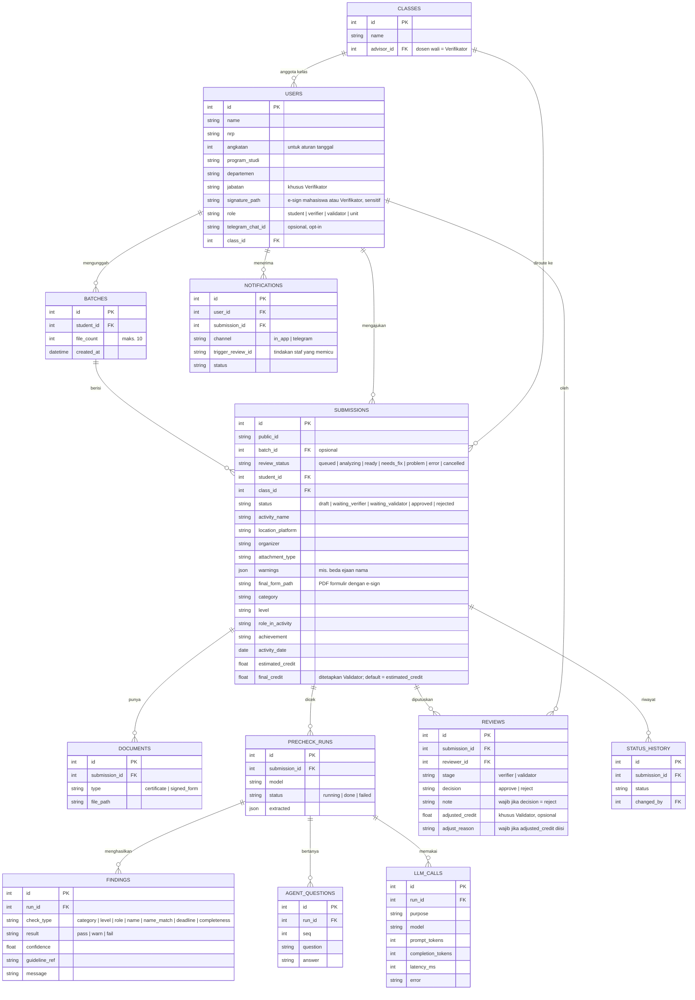

# Product Requirements Document (PRD)

## SKEM AI Co-Pilot

**Versi:** 0.11 (Peran staf diperjelas, proses online) · **Tim:** [Nama Tim] · **Event:** PENS Hackathon 2026, CBN Track · **Kategori:** Digital Campus Worker (Choice 1) · **Tanggal:** 9 Oktober 2026

> **Perubahan v0.11 (keputusan tim):**
> 1. **Verifikator hanya membaca dan memutuskan.** Aksinya hanya **Setujui** atau **Tolak** (alasan wajib saat menolak). Verifikator tidak bisa mengedit atau mengoverride data apa pun; jika data tidak sesuai dengan bukti, pengajuan ditolak. Fitur override dan kolom `overrides` dihapus.
> 2. **Validator** melakukan validasi administratif dan teknis serta finalisasi hasil: aksi **Validasi** atau **Tolak** (alasan wajib saat menolak), dan boleh **mengubah kredit final dengan alasan wajib** (tercatat). Tugas Validator di Pedoman berupa kelola data/akun pengguna (CRUD) dan dukungan teknis **tidak dicakup aplikasi ini**; akun dan kelas berasal dari data seed dan mock login.
> 3. **Seluruh proses pengajuan wajib online** lewat aplikasi: tidak ada formulir kertas, tanda tangan basah, atau unggah formulir bertanda tangan. Yang diwajibkan online adalah **jalur pengajuannya**; kegiatan luring tetap bisa diajukan dengan bukti sertifikat PDF. Pedoman membolehkan tanda tangan luring, jadi penghapusan jalur ini adalah keputusan tim yang butuh persetujuan PENS saat adopsi.
> 4. **Tingkat kegiatan** ditentukan oleh **cakupan peserta**, bukan lokasi acara (Pedoman, Ketentuan Umum poin 12): Internasional ≥3 negara, Nasional ≥3 provinsi, Regional ≥1 provinsi (3 kota/kabupaten), Kampus (lingkungan PENS). Pertanyaan balik agent disajikan sebagai pilihan jawaban.
> 5. Sisa rujukan lama ke Google Form/Data Studio pada kebutuhan non-fungsional dan risiko dibersihkan.
>
> **Perubahan v0.10 (keputusan tim):** Integrasi Google Sheet/spreadsheet SKEM **dihapus** dari MVP. Semua data tersimpan di database aplikasi; Checkpoint B otomatis hanya membuat PDF formulir final dan meneruskan ke Validator. Monitoring dilakukan di dalam aplikasi. Integrasi ke sistem resmi PENS menjadi langkah adopsi berikutnya.
>
> **Perubahan v0.9 (keputusan tim):**
> 1. **Alur satu arah:** mahasiswa mengajukan → Verifikator memeriksa → jika disetujui, **langsung diteruskan ke Validator** (tidak kembali ke mahasiswa); jika tidak, Ditolak. Mahasiswa hanya melihat status. Langkah "Kirim Pengajuan" oleh mahasiswa setelah persetujuan dihapus; Checkpoint B menjadi langkah otomatis sistem.
> 2. **E-sign mahasiswa** untuk bagian IV Pernyataan Mahasiswa: diunggah/digambar sekali pada pengajuan pertama, lalu dipakai otomatis untuk pengajuan berikutnya (pola yang sama dengan Verifikator).
> 3. **Penanda "Diubah dari hasil AI" dihapus** dari semua layar. Hasil baca AI asli tetap tersimpan di log internal untuk mengukur akurasi, tetapi tidak ditampilkan.
> 4. **Aturan tanggal:** memakai **tanggal selesai** kegiatan. Sumber: Pedoman Pelaksanaan SKEM Reguler (dokumen pjj.pens.ac.id, dibuat 2 Juni 2026), bagian Ketentuan Peralihan, sebagaimana ditafsirkan tim.
>
> **Perubahan v0.8 (keputusan tim dan formulir resmi):**
> 1. **Identitas mahasiswa selalu dari akun yang login**, tidak bisa diedit. Perbedaan kecil antara identitas akun dan nama di sertifikat hanya memunculkan **peringatan**; mahasiswa tetap bisa mengajukan. Keputusan diterima/ditolak ada pada Verifikator/Validator. Tidak ada kewajiban surat keterangan penyelenggara di aplikasi.
> 2. **Mahasiswa boleh mengedit metadata kegiatan**; Verifikator tetap memeriksa ulang. Perubahan dari hasil AI tetap ditandai sebagai bantuan bagi Verifikator.
> 3. **Aturan tanggal kegiatan per angkatan** (keterangan tim): angkatan 2024 → tanggal kegiatan sejak 1 Januari 2024; angkatan 2025 dan seterusnya → tanggal kegiatan paling lama 1 tahun sebelum tanggal pengajuan.
> 4. **E-sign Verifikator:** pada persetujuan pertama, Verifikator wajib mengunggah atau menggambar tanda tangan; tanda tangan disimpan dan otomatis dibubuhkan setiap kali menekan "Setujui". Mahasiswa tidak perlu lagi mengunggah formulir bertanda tangan.
> 5. **Isi formulir mengikuti formulir resmi FM.MHS.PENGAJUANSKEM** (Identitas, Informasi Kegiatan, Verifikasi, Pernyataan Mahasiswa, Lampiran Bukti). Kategori, tingkat, peran, dan kredit tidak ada di formulir kertas; data itu masuk ke data pengajuan di sistem.
>
> **Perubahan v0.7 (keputusan tim: unggah batch):**
> 1. **Unggah batch maksimal 10 PDF sekaligus.** Satu file = satu draf pengajuan = satu kegiatan. AI menganalisis bergantian dalam antrian di server; satu file yang bermasalah atau menunggu jawaban tidak menghentikan file lain.
> 2. **Tiga status hasil analisis AI:** **Ready**, **Perlu perbaikan**, **Bermasalah**, ditambah status proses (Menunggu antrean, Sedang dianalisis, Gagal dianalisis) dan Dibatalkan.
> 3. **AI langsung mengisi formulir** untuk file yang Ready, tanpa menunggu file lain. Tidak ada yang terkirim otomatis: mahasiswa memeriksa dan bisa mengedit field dulu.
> 4. **Halaman detail pengajuan:** pratinjau PDF sertifikat, pratinjau formulir terisi, dan panel metadata yang bisa diedit.
> 5. **Pengajuan ke Verifikator satu per satu atau sekaligus** ("Ajukan semua yang Ready") dengan dialog konfirmasi. Hanya yang berstatus Ready yang ikut.
> 6. **Dari Pedoman:** *(diganti di v0.8: nama berbeda kecil cukup peringatan; aturan tanggal mengikuti aturan per angkatan)*
>
> **Perubahan v0.6 (setelah menerima Brief CBN, panduan OpenCode, dan Pedoman SKEM resmi):**
> 1. **Model AI dari gateway CBN, bukan Gemini.** Token dan model disediakan panitia (Qwen, DeepSeek; kandidat vision: Qwen 3.8 Omni Flash). Kemampuan membaca gambar **belum terbukti**: diuji pada jam pertama acara, dengan cadangan OCR atau model lain.
> 2. **Empat peran sesuai Pedoman (hlm. 17):** Mahasiswa, Verifikator, Validator (juga admin SKEM), dan Unit Kemahasiswaan (monitoring, evaluasi, kebijakan, mediasi). Tampilan Unit Kemahasiswaan hanya read-only.
> 3. **Keputusan Verifikator hanya "disetujui" atau "ditolak"** (dengan catatan). "Minta revisi" dihapus; mahasiswa memperbaiki lalu mengajukan ulang.
> 4. **Bukti kegiatan berformat PDF** (Pedoman). Input utama PDF yang diubah menjadi gambar halaman; foto HP menjadi kasus uji tambahan.
> 5. **Prioritas memakai MoSCoW.** Notifikasi tetap ada sebagai **Should have** (bukan Must, bukan dihapus), dengan syarat pemicunya tindakan staf, sesuai aturan panitia bahwa pengiriman pesan butuh persetujuan staf. **Kanalnya diganti dari WhatsApp ke bot Telegram** (Bot API resmi, tanpa nomor khusus, tanpa risiko blokir, cukup long polling di localhost).
> 6. **Syarat dan penilaian panitia masuk sebagai requirement:** hasil dan riwayat bertahan setelah refresh, log token per panggilan LLM, bagian simulasi ditandai jelas, input baru saat demo, README dengan hasil uji.
> 7. **Rencana kerja diganti menjadi rencana sekitar 20 jam** (acara 9–10 Oktober). Pertanyaan terbuka yang sudah terjawab dicoret. ERD ditambahkan (Bagian 10).
>
> **Perubahan v0.5 (keputusan teknis tim setelah meninjau masukan):**
> 1. **Tanpa OCR lokal.** Dokumen dibaca langsung oleh model multimodal (vision), sehingga satu langkah yang rapuh dihilangkan. Klaim privasi diubah menjadi jujur: gambar dokumen diproses model cloud; demo hanya memakai data dummy; pencocokan nama dan penyamaran data tersimpan dilakukan di server sendiri; model lokal menjadi opsi produksi.
> 2. **RAG diganti section-lookup.** Pedoman dipecah per bagian dan diberi tag (jenis kesalahan, kategori), lalu dicari lewat `get_relevant_sections(context)`. Rujukan "Kenapa?" selalu benar karena dipetakan manual. Istilah "RAG" tidak lagi dipakai.
> 3. **Google Form digantikan sepenuhnya.** Co-Pilot menjadi kanal pengajuan; tidak ada jalur fallback isian siap salin. Pengajuan ditulis sebagai baris di spreadsheet SKEM.
> 4. **Checkpoint B disederhanakan:** cek file ada, bandingkan isian, tulis satu baris. Tanpa antrian kirim ulang otomatis dan tanpa dashboard tiruan terpisah (demo menampilkan Google Sheet langsung). Staff Review Queue didahulukan.
> 5. **Notifikasi WhatsApp tetap Stretch**, dari nomor khusus baru; notifikasi dalam aplikasi menjadi dasar.
> 6. **Test set dimulai di Fase 1** (10 kasus), dan akurasi akhir dilaporkan pada kasus yang tidak dipakai menyetel prompt.
>
> **Perubahan v0.4 (berdasarkan wawancara Verifikator dan masukan dosen pembimbing):**
> 1. **Problem Statement ditulis ulang agar sesuai bukti.** Dari 2 pengajuan di kelas yang diwawancarai, 0 dikembalikan, sehingga klaim "penolakan berulang" dan "beban staf tumbuh sementara staf tetap" dilepas. Verifikator ternyata dosen wali per kelas, jadi beban tersebar. Sudut baru: dosen wali memverifikasi di samping mengajar, aturan harus diterapkan konsisten di banyak kelas, dan kesalahan umum dicegah sebelum volume menumpuk.
> 2. **Routing per kelas:** pengajuan hanya sampai ke dosen wali kelas mahasiswa tersebut; antrian staf difilter per kelas.
> 3. **Angka wawancara masuk sebagai baseline:** 10–20 berkas per mahasiswa, 3–5 menit per berkas (sumber: satu Verifikator).
> 4. **Fitur baru dari dosen pembimbing:** Status pengajuan masuk Core (digabung dengan Progress & Advisor); notifikasi WhatsApp menjadi Stretch prioritas pertama; info event/lomba menjadi Stretch di dalam Advisor, terhubung ke estimasi poin SKEM.
> 5. Klaim "100+ kombinasi" diganti "banyak kombinasi" sampai tabel dihitung sendiri saat digitalisasi.
>
> **Perubahan v0.3:** Checkpoint B tidak lagi menghasilkan isian siap salin, melainkan **mengirim pengajuan langsung ke spreadsheet SKEM** (sumber data yang sama dengan Google Form dan Sistem Monitoring). Mahasiswa tidak perlu membuka Google Form lagi, sementara dashboard monitoring resmi tetap berjalan tanpa perubahan. Nama fitur ketiga diseragamkan menjadi **Progress & Advisor**.
>
> **Perubahan v0.2 dari v0.1:** (1) produk diposisikan sebagai *AI first-pass reviewer* untuk staf, bukan sekadar asisten mahasiswa; (2) posisi dalam alur resmi diperjelas menjadi dua checkpoint; (3) pipeline diubah menjadi agent yang bisa bertanya balik; (4) Staff Review Queue naik dari Stretch ke Core, Credit Estimator dilebur ke Pre-Check Agent; (5) RAG Chatbot dihapus sebagai fitur tersendiri dan dilebur ke penjelasan "Kenapa?"; (6) metrik ilustratif diganti rencana pengukuran nyata; (7) narasi sustainability dipertajam (operasional + maintainability).

---

## 1. Overview

SKEM AI Co-Pilot adalah **AI first-pass reviewer**: digital worker yang mengambil alih pemeriksaan kesalahan berulang pada pengajuan SKEM sebelum pengajuan sampai ke Verifikator (dosen wali kelas) dan Validator. Produk ini bekerja di dua titik dalam alur resmi PENS, menghasilkan dokumen dan isian yang sudah rapi, dan menyajikan hasil pemeriksaan AI kepada staf dalam bentuk antrian yang siap ditinjau.

Mahasiswa menyelesaikan seluruh proses di satu tempat, dari upload bukti sampai status akhir, **tanpa membuka Google Form**. Co-Pilot menggantikan Google Form sebagai kanal pengajuan dan menyimpan seluruh data pengajuan di database aplikasinya sendiri. Status, antrian staf, dan monitoring tersedia langsung di aplikasi. Seluruh proses berjalan online: tidak ada formulir kertas atau tanda tangan basah.

Produk ini **tidak mengambil keputusan akhir**. Seluruh keputusan verifikasi dan validasi tetap berada di tangan manusia.

**Kalimat posisi:**
> Co-Pilot mengerjakan pemeriksaan yang berulang, sehingga staf bisa fokus menilai hal yang memang butuh manusia: substansi dan keabsahan kegiatan.

---

## 2. Problem Statement

Mulai angkatan 2024, PENS mewajibkan mahasiswa D3 dan Sarjana Terapan mengumpulkan minimal **3,0 SKEM** sebagai syarat lulus (Peraturan Akademik PENS 2024 Pasal 30). Pengajuan melewati **dua tahap review manual**: Verifikator (substansi & keabsahan bukti) dan Validator (administratif & teknis). Infrastrukturnya masih sederhana: Google Form untuk pengajuan dan Google Data Studio untuk monitoring.

**Siapa Verifikator sebenarnya** *(temuan wawancara)*: setiap kelas memiliki Verifikator sendiri, yaitu **dosen wali kelas tersebut**. Mahasiswa kelas A tidak dapat mengajukan ke dosen wali kelas B. Artinya verifikasi dikerjakan dosen sebagai tugas tambahan di samping mengajar, dan jumlah Verifikator banyak (satu per kelas, di setiap program studi dan departemen).

**Beban kerja yang tercatat** *(sumber: wawancara satu Verifikator)*:
- Satu mahasiswa dapat mengajukan **10–20 berkas**.
- Menganalisis **satu berkas membutuhkan sekitar 3–5 menit**, yaitu 30–100 menit per mahasiswa bagi dosen walinya.

Pedoman SKEM resmi sendiri mendokumentasikan **lima kesalahan umum**:

1. Salah memilih kategori kegiatan
2. Salah menentukan tingkat kegiatan (harus berdasarkan cakupan peserta, bukan lokasi acara)
3. Nama kegiatan ditulis singkatan, bukan nama lengkap resmi
4. Dokumen pendukung tidak lengkap, termasuk formulir verifikasi bertanda tangan
5. Nama pada sertifikat tidak sesuai dengan data akademik

Setiap pengajuan yang mengandung kesalahan ini harus **dibuka, dibaca, dan dikembalikan oleh reviewer**, lalu diperbaiki dan diajukan ulang oleh mahasiswa.

**Yang belum terbukti (dinyatakan terbuka):** sistem ini baru. Di kelas yang diwawancarai baru 2 mahasiswa yang mengajukan, dan keduanya diterima tanpa dikembalikan. Seberapa sering kelima kesalahan itu benar-benar terjadi belum bisa disimpulkan dari satu kelas. Produk ini bertumpu pada risiko yang sudah dicatat pedoman dan beban waktu yang sudah dilaporkan Verifikator, bukan pada klaim lonjakan penolakan.

**Mengapa tetap relevan sekarang:**

- Tabel bobot kredit Komponen 3 memiliki **banyak kombinasi** kategori × tingkat × peran × capaian *(jumlah pastinya dihitung saat digitalisasi tabel)*, sehingga mudah keliru bagi mahasiswa maupun reviewer.
- Setiap kelas punya Verifikator sendiri, sehingga ada risiko **tafsir aturan yang berbeda antar kelas** *(hipotesis, perlu dikonfirmasi ke Verifikator lain)*.
- Setiap angkatan baru menambah mahasiswa dan kelas yang wajib SKEM, dan pengajuan kemungkinan menumpuk menjelang kelulusan *(belum terverifikasi)*.
- Mahasiswa tidak punya visibilitas yang jelas atas status pengajuan dan sisa kredit menuju 3,0.

---

## 3. Goals & Success Metrics

### 3.1 Tujuan Demo Hackathon

- Menunjukkan alur end-to-end: unggah batch → Pre-Check Agent (termasuk pertanyaan balik) → formulir terisi → mahasiswa menandatangani dan mengajukan → Verifikator menyetujui (e-sign) → otomatis masuk antrian Validator → Validator memvalidasi, tanpa membuka Google Form.
- Menunjukkan minimal satu skenario di mana agent mencegah kesalahan nomor 2 (salah tingkat) melalui pertanyaan balik.
- Menunjukkan sisi staf secara langsung di layar, bukan hanya diklaim.

### 3.2 Metrik yang Akan Diukur (bukan angka ilustratif)

| Metrik | Cara Ukur | Sumber |
|---|---|---|
| Tingkat deteksi per jenis kesalahan | Persentase kasus yang terdeteksi benar pada test set | Test set bertahap: 10 kasus di akhir Fase 1, 30–50 kasus di Fase 4, dengan kunci jawaban |
| Akurasi klasifikasi kategori & tingkat | Kecocokan dengan kunci jawaban (top-1 dan top-3) | Test set yang sama |
| Akurasi estimasi kredit | Persentase estimasi yang tepat sama dengan kunci jawaban | Test set yang sama |
| Baseline masalah | Frekuensi dan alasan pengembalian, bagian form yang membingungkan, waktu per pengajuan. **Fokus pada mahasiswa yang sudah pernah mengajukan** | Survei mahasiswa angkatan 2024–2025 |
| Baseline beban Verifikator | Berkas per mahasiswa, menit per berkas, persen dikembalikan, jumlah mahasiswa per kelas | Wawancara Verifikator *(sudah ada 1: 10–20 berkas, 3–5 menit)*; tambah Verifikator lain |
| Konsistensi antar kelas | Apakah ada Verifikator yang menafsirkan aturan berbeda (tingkat, kategori ambigu) | Wawancara beberapa dosen wali |
| Info Validator | Siapa, berapa orang, dan apakah memeriksa pengajuan lintas kelas | Wawancara Validator / Unit Kemahasiswaan |
| Waktu pengisian | Waktu mengisi pengajuan manual vs dengan Co-Pilot | Uji coba singkat dengan beberapa mahasiswa |
| Penggunaan token | Token input/output dan latensi per panggilan LLM; total per pengajuan; hasil sebelum/sesudah optimasi disertai akurasinya | Log panggilan LLM (tabel `LLM_CALLS`) |

**Prinsip:** tidak ada angka dampak yang dikarang di pitch. Semua angka harus berasal dari pengukuran di atas, dengan sumber dan ukuran sampel disebut apa adanya (misalnya "menurut satu Verifikator yang kami wawancarai").

### Aturan test set

- Test set dibuat **sejak Fase 1** (10 kasus), supaya setiap perubahan prompt dan ambang confidence langsung terukur, bukan berdasarkan perasaan.
- Skenario demo utama ("Juara II Lomba Desain, 5 provinsi") adalah salah satu entri test set.
- Sertakan foto sertifikat dari HP (miring, silau) karena itulah kondisi nyata pembacaan dokumen.
- **Pisahkan data penyetelan dan data uji.** Kasus yang dipakai menyetel prompt tidak dipakai untuk melaporkan akurasi akhir. Sebagian kasus yang dibuat di Fase 4 ditahan dan baru dipakai untuk angka final.
- Sertifikat asli (dengan izin tertulis) dicatat terpisah, dan tidak dikirim ke model cloud tanpa persetujuan pemiliknya.

### 3.3 Rumus Estimasi Waktu (diisi dengan data nyata)

Beban dihitung **per Verifikator (per kelas)**, bukan dijumlahkan menjadi satu angka besar, karena bebannya tersebar.

```
Waktu review per mahasiswa      = berkas per mahasiswa × menit per berkas
                                = 10–20 × 3–5 menit = 30–100 menit   (sumber: wawancara)

Beban satu kelas                = mahasiswa per kelas × waktu review per mahasiswa
                                  (jumlah mahasiswa per kelas: BELUM ADA)

Waktu yang dapat dihemat        = (berkas yang tercegah dikembalikan × menit per siklus ulang)
                                + (berkas × menit lebih cepat per berkas karena ada catatan AI)
                                  (% dikembalikan: BELUM ADA; % tercegah: dari uji akurasi)
```

Penghematan **bukan** seluruh waktu review: staf tetap meninjau setiap berkas. Yang dihemat hanya siklus ulang yang tercegah dan selisih waktu per berkas. Jika hasil hitungan kecil, laporkan apa adanya dan tambahkan sisi mahasiswa (waktu revisi dari survei).

> Catatan: arti "10–20 berkas" perlu dikonfirmasi: 10–20 kegiatan per mahasiswa selama masa studi, atau 10–20 dokumen per pengajuan.

---

## 4. Target Users / Personas

| Persona | Peran | Kebutuhan Utama | Fitur Utama |
|---|---|---|---|
| **Verifikator (dosen wali kelas)** | Pengguna utama sisi staf; memverifikasi di samping mengajar; hanya menangani mahasiswa kelasnya | Formulir yang sampai sudah benar secara klasifikasi dan format, waktu per berkas lebih singkat, dan tafsir aturan yang seragam | Staff Review Queue per kelas (baca-saja; Setujui atau Tolak), draf formulir dari Checkpoint A |
| **Validator / Admin SKEM** | Validasi administratif dan teknis serta finalisasi hasil, termasuk menyesuaikan kredit final bila perlu *(Pedoman hlm. 17; tugas kelola data/akun dan dukungan teknis tidak dicakup aplikasi ini; jumlah orang belum diketahui)* | Pengajuan yang lengkap dan konsisten secara administratif | Antrian Validator lintas kelas (Should have), Checkpoint B |
| **Mahasiswa** | Pengguna yang berinteraksi langsung dengan agent | Tahu pengajuannya benar sebelum dikirim, tahu statusnya, estimasi poin, progres menuju 3,0 | Pre-Check Agent, Status, Progress & Advisor |
| **Unit Kemahasiswaan** | Monitoring dan evaluasi, kebijakan teknis, mediasi perselisihan *(Pedoman hlm. 17)*; tidak memverifikasi atau memvalidasi | Gambaran pelaksanaan SKEM, beban operasional terkendali, aturan mudah diperbarui | Tampilan monitoring read-only (Could have), Rule Engine berbasis data |

---

## 5. Posisi dalam Alur Resmi: Dua Checkpoint

```
Unggah bukti (batch, maks. 10 PDF)
   → [Checkpoint A: Pre-Check Agent] → formulir terisi otomatis, mahasiswa memeriksa dan menandatangani (e-sign)
   → Verifikator (dosen wali kelas): hanya membaca, lalu Setujui (e-sign) atau Tolak (alasan wajib)
        → Ditolak: selesai, mahasiswa melihat status dan catatan
        → Disetujui: [Checkpoint B: otomatis oleh sistem]
             → cek kelengkapan, buat PDF formulir final
             → Validator: Validasi (boleh mengubah kredit final + alasan) atau Tolak (alasan wajib)
   → Nilai final tersimpan di aplikasi (monitoring di dalam aplikasi)
```

| | Checkpoint A | Checkpoint B |
|---|---|---|
| **Waktu** | Sebelum ke Verifikator | Otomatis sesaat setelah Verifikator menyetujui |
| **Pemeriksaan** | Kategori, tingkat, peran, capaian, nama kegiatan lengkap, kecocokan nama, rentang tanggal per angkatan | Formulir final punya e-sign mahasiswa dan Verifikator, bukti terlampir, data lengkap |
| **Output** | Estimasi kredit + formulir terisi, ditandatangani mahasiswa | PDF formulir final, pengajuan masuk antrian Validator |
| **Pelaku** | Mahasiswa + AI | Sistem (tanpa tindakan mahasiswa) |

### Routing per kelas

Pengajuan hanya boleh sampai ke dosen wali kelas mahasiswa tersebut. Karena itu:
- Profil mahasiswa memuat atribut **kelas** dan **dosen wali (Verifikator)**; pengajuan otomatis diarahkan ke Verifikator yang sesuai.
- Antrian Verifikator hanya menampilkan pengajuan kelasnya sendiri.
- Validator/admin memiliki tampilan lintas kelas.

Kedua output dirancang untuk **mengurangi langkah mahasiswa**, sehingga ada alasan nyata untuk memakai Co-Pilot (lihat Bagian 12, Adopsi).

### Hubungan dengan sistem lama (Google Form dan Data Studio)

Co-Pilot menggantikan Google Form sebagai kanal pengajuan dan menyimpan data di database sendiri. Untuk hackathon, **tidak ada integrasi ke Google Sheet atau dashboard Data Studio resmi**; monitoring dilakukan di dalam aplikasi (status mahasiswa, antrian staf, tampilan Unit Kemahasiswaan). Integrasi ke sistem resmi PENS (melalui API atau ekspor data) adalah langkah adopsi berikutnya, bukan bagian MVP.

---

## 6. Scope

Prioritas memakai MoSCoW untuk acara sekitar 20 jam. Should have hanya dikerjakan setelah seluruh Must have berjalan end-to-end.

### Must have

1. **Pre-Check Agent** (baca PDF/gambar, lima pemeriksaan, batas 1 tahun, estimasi kredit, "Kenapa?" berbasis section-lookup, pertanyaan balik)
1a. **Unggah batch (maks. 10 PDF) dengan antrian analisis**, tiga status hasil (Ready / Perlu perbaikan / Bermasalah), formulir terisi otomatis untuk yang Ready, halaman detail dengan metadata yang bisa diedit, dan pengajuan ke Verifikator satu per satu atau sekaligus
2. **Staff Review Queue** per kelas untuk Verifikator (baca-saja: setujui, atau tolak dengan alasan wajib; tidak ada edit data)
3. **Status pengajuan** dengan timeline dan progres kredit menuju 3,0
4. **Persistensi** hasil dan riwayat (bertahan setelah refresh) dan **log token** per panggilan LLM
5. **Evaluasi test set** dengan kunci jawaban dan kasus held-out

### Should have

6. **Notifikasi bot Telegram** (pemicu tindakan staf; notifikasi dalam aplikasi sebagai dasar dan cadangan)
7. **Antrian Validator** lintas kelas (Validasi atau Tolak dengan alasan; boleh mengubah kredit final dengan alasan wajib)
8. **Checkpoint B otomatis**: setelah Verifikator menyetujui, sistem membuat PDF formulir final dan meneruskan pengajuan ke antrian Validator

### Could have

9. **Rekomendasi kegiatan Komponen 3 dan info event/lomba** di Advisor, terhubung ke estimasi poin SKEM (data event dummy)
10. **Tampilan monitoring read-only untuk Unit Kemahasiswaan** (jumlah pengajuan per status/kelas, kesalahan paling sering)
11. Ekspor riwayat pre-check ke CSV untuk audit

### Won't have (kali ini)

- Integrasi dengan Google Sheet dan dashboard monitoring resmi PENS (Data Studio), dan perubahan apa pun pada sistem resmi
- Autentikasi/SSO resmi PENS (mock login)
- Kelola data dan akun pengguna (CRUD) serta dukungan teknis, yaitu bagian tugas Validator di Pedoman (akun dan kelas dari data seed)
- Jalur pengajuan luring: formulir kertas, tanda tangan basah, atau unggah formulir bertanda tangan (seluruh pengajuan online)
- Verifikator mengedit atau mengoverride data pengajuan (Verifikator hanya Setujui atau Tolak)
- Deteksi keaslian atau pemalsuan sertifikat (kewenangan Verifikator)
- Aplikasi mobile native
- Penanganan sengketa/banding (tetap manual via Unit Kemahasiswaan)
- RAG/vector search dan chatbot tanya-jawab bebas yang berdiri sendiri
- Notifikasi WhatsApp (diganti bot Telegram di prototipe) dan distribusi bot ke seluruh mahasiswa untuk produksi
- Jalur fallback isian siap salin untuk Google Form (Co-Pilot menggantikan Google Form)
- Portal info event/lomba kampus yang berdiri sendiri

---

## 7. Functional Requirements

### FR-1: Pre-Check Agent — **Must have**

**User story:** Sebagai mahasiswa, saya ingin tahu apakah pengajuan saya sudah benar dan berapa estimasi kreditnya sebelum menyerahkannya ke Verifikator, supaya tidak ditolak.

**Input:**
- File bukti kegiatan: **PDF** (sesuai Pedoman, bukti wajib berformat PDF); JPG/PNG foto HP diterima sebagai kasus tambahan
- Deskripsi singkat dari mahasiswa: nama kegiatan, tanggal, peran, capaian
- Profil mahasiswa (nama lengkap, NRP, kelas, dosen wali; data dummy untuk demo)

**Tools yang dipakai agent:**

| Tool | Fungsi | Dijalankan oleh |
|---|---|---|
| `read_document` | Membaca gambar/PDF bukti langsung dan mengembalikan field terstruktur (JSON) beserta confidence | Model vision dari gateway CBN (kandidat: Qwen 3.8 Omni Flash, diuji di jam pertama); halaman PDF diubah menjadi gambar dan diperkecil sebelum dikirim |
| `get_relevant_sections` | Mengembalikan bagian Pedoman yang relevan beserta rujukannya, berdasarkan tag jenis kesalahan/kategori | Lookup deterministik (bukan retrieval vektor) |
| `lookup_credit_table` | Mengembalikan skor kredit untuk kombinasi kategori/tingkat/peran/capaian | Rule Engine (kode deterministik) |
| `check_deadline` | Memeriksa **tanggal selesai** kegiatan menurut angkatan mahasiswa: **angkatan 2024** → valid jika tanggal kegiatan ≥ 1 Januari 2024; **angkatan 2025 dan seterusnya** → valid jika tanggal kegiatan berada di antara (tanggal pengajuan − 1 tahun) dan tanggal pengajuan, inklusif. Kegiatan bertanggal di masa depan tidak valid. Angkatan diambil dari profil akun; aturan disimpan sebagai konfigurasi | Kode deterministik |
| `match_name` | Mencocokkan nama di dokumen dengan profil mahasiswa (fuzzy string matching) | Server sendiri, tidak lewat LLM |
| `ask_student` | Mengajukan pertanyaan klarifikasi ke mahasiswa | Agent → UI |

**Proses:**
1. Halaman PDF bukti diubah menjadi gambar (diperkecil agar hemat token), lalu model vision membacanya langsung (`read_document`) dan mengembalikan field terstruktur (JSON tervalidasi): nama kegiatan, tanggal, nama penerima, peran, capaian, penyelenggara. Setiap panggilan dicatat (model, token, latensi). Jika vision tidak terbaca, cadangan: OCR atau model lain.
2. Nama dan NRP pada hasil ekstraksi dicocokkan dengan profil mahasiswa di server sendiri (`match_name`), lalu disamarkan sebelum disimpan atau dicatat di log.
3. LLM menalar kategori kandidat, tingkat, dan peran dengan konteks bagian Pedoman yang relevan (`get_relevant_sections`), dalam format JSON.
4. Jika confidence di bawah ambang batas pada kategori, tingkat, atau peran, agent memanggil `ask_student`. **Maksimal 3 pertanyaan per pengajuan.**
5. Agent memeriksa nama kegiatan (singkatan vs nama lengkap) dan batas waktu.
6. Skor dihitung oleh `lookup_credit_table`. **LLM tidak pernah menghasilkan angka skor.**
7. Sistem menyusun hasil pre-check dan draf formulir verifikasi (Checkpoint A).

**Output:**
- Status per pemeriksaan (lolos / perlu perhatian / bermasalah) untuk kelima jenis kesalahan + batas waktu
- Kategori, tingkat, peran, dan capaian terdeteksi, masing-masing dengan confidence score
- Estimasi kredit dengan label "Estimasi. Nilai final ditetapkan Validator."
- Tombol **"Kenapa?"** pada setiap temuan: penjelasan singkat dan rujukan bagian Pedoman SKEM
- Draf formulir verifikasi terisi

**Edge cases:**
- Dokumen tidak terbaca atau confidence field rendah → tandai field tersebut, minta mahasiswa mengisi atau memfoto ulang
- Kategori ambigu → tampilkan top-3 kandidat dengan confidence, mahasiswa memilih
- Kombinasi tidak ada di tabel bobot → tidak menebak skor; tampilkan pesan jelas dan arahkan ke Unit Kemahasiswaan
- Tanggal kegiatan di luar rentang yang berlaku untuk angkatan mahasiswa → **Bermasalah**, jelaskan aturannya dan rentang tanggal yang valid; tindakan yang masuk akal hanya Batalkan (atau unggah ulang jika salah file). Contoh: mahasiswa angkatan 2025 mengajukan pada 7 Juli 2026 → valid untuk kegiatan 7 Juli 2025 sampai 7 Juli 2026.
- Nama di sertifikat berbeda kecil dari identitas akun (salah ketik, gelar, nama tengah, singkatan) → tetap **Ready** dengan **peringatan** yang terlihat oleh mahasiswa dan Verifikator; pengajuan tetap bisa dikirim. Keputusan akhir ada pada Verifikator/Validator.
- Nama di sertifikat jelas milik orang lain (mis. akun Budi Santoso, sertifikat atas nama Nisa Rahma) → **Bermasalah**: Unggah ulang atau Batalkan

**Acceptance criteria:**
- Untuk sertifikat lomba yang tidak menyebutkan asal peserta, agent bertanya tentang cakupan peserta sebelum menentukan tingkat. Tingkat ditentukan dari cakupan peserta (Internasional ≥3 negara, Nasional ≥3 provinsi, Regional ≥1 provinsi/3 kota/kabupaten, Kampus), bukan lokasi acara; pertanyaan disajikan sebagai pilihan jawaban.
- Setiap estimasi kredit dapat ditelusuri ke satu baris di tabel bobot JSON.
- Setiap temuan memiliki penjelasan dan rujukan Pedoman.

### FR-1a: Unggah Batch, Antrian Analisis, dan Status Hasil — **Must have**

**User story:** Sebagai mahasiswa dengan banyak kegiatan, saya ingin mengunggah beberapa sertifikat sekaligus, memperbaiki hanya yang bermasalah, dan mengajukan yang sudah siap tanpa menunggu yang lain.

**Unggah**
- Mahasiswa menyeret atau memilih **maksimal 10 PDF** dalam satu unggahan. Lebih dari 10 → tolak dengan pesan jelas.
- **Satu file = satu draf pengajuan = satu kegiatan.** Dokumen pendukung lain (mis. SK) dapat ditambahkan dari halaman detail.
- Semua draf dari satu unggahan dikelompokkan sebagai satu batch, dan tampil sebagai daftar kartu.

**Antrian analisis**
- Analisis berjalan **di server**, bukan di browser, sehingga tetap berlanjut dan hasilnya tetap ada setelah halaman di-refresh.
- Diproses bergantian, dengan **batas paralel 1–2 file** supaya tidak melewati batas laju gateway. Progres: "3 dari 8 selesai".
- **Tidak ada yang memblokir.** Jika file 2 butuh konfirmasi, AI tetap melanjutkan file 3, 4, 5. File 2 menunggu tindakan mahasiswa tanpa menahan yang lain.
- File yang Ready **langsung diisikan ke formulir** begitu selesai dianalisis, tanpa menunggu file lain atau jawaban untuk file lain.

**Status per kartu**

| Status | Arti | Tindakan di kartu |
|---|---|---|
| Menunggu antrean | Belum diproses | Batalkan |
| Sedang dianalisis | Model sedang membaca dan memeriksa | (progres) |
| **Ready** | Metadata tidak ada kejanggalan (boleh disertai peringatan kecil, mis. beda ejaan nama); formulir sudah terisi dan siap diajukan ke Verifikator | Detail, Ajukan |
| **Perlu perbaikan** | Ada data kegiatan yang tidak jelas (mis. asal peserta tidak disebut, kategori ambigu, tanggal tidak terbaca); perlu konfirmasi mahasiswa sebelum formulir lengkap | Detail, Jawab/konfirmasi |
| **Bermasalah** | Sertifikat jelas milik orang lain, bukan sertifikat/bukti kegiatan, atau tanggal kegiatan di luar rentang yang berlaku untuk angkatannya | Detail, **Unggah ulang**, **Batalkan** |
| Gagal dianalisis | Kesalahan sistem (timeout, gateway error, PDF rusak) — bukan kesalahan mahasiswa | Coba lagi, Batalkan |
| Dibatalkan | Mahasiswa membatalkan kartu ini | Kartu hilang dari daftar; batch lain tidak terpengaruh |

- **Batalkan** hanya menghapus kartu itu (draf dan filenya), bukan seluruh batch.
- **Unggah ulang** mengganti file di kartu yang sama lalu memasukkannya kembali ke antrian.
- **Setelah konfirmasi** pada kartu Perlu perbaikan, pemeriksaan deterministik (tabel bobot, batas waktu, kecocokan nama) dijalankan ulang **tanpa memanggil model lagi** bila tidak perlu, lalu status berubah menjadi Ready. Ini menghemat token.
- Pertanyaan balik agent **terikat per kartu**, tidak pernah bercampur antar pengajuan. Daftar "Perlu perhatian" mengumpulkan kartu yang menunggu jawaban.

**Halaman detail pengajuan** (tombol "Detail" ada di semua kartu yang sudah dianalisis)
- Kiri: pratinjau PDF sertifikat. Tengah: pratinjau formulir verifikasi yang sudah terisi. Kanan: panel **metadata yang bisa diedit** (nama kegiatan, kategori, tingkat, peran, capaian, tanggal, penyelenggara) beserta confidence dan tombol "Kenapa?".
- Setiap perubahan metadata langsung memperbarui pratinjau formulir dan menjalankan ulang pemeriksaan deterministik serta estimasi kredit.
- **Identitas dan edit:** bagian Identitas Mahasiswa (nama, NRP, program studi, departemen) diambil dari akun yang login dan tidak bisa diedit. Metadata kegiatan boleh diedit mahasiswa tanpa penanda apa pun; Verifikator tetap memeriksa ulang. Hasil baca AI asli hanya disimpan di log internal untuk evaluasi akurasi.

**Isi formulir resmi (FM.MHS.PENGAJUANSKEM, 2 halaman) dan sumber datanya**

| Bagian formulir | Field | Sumber |
|---|---|---|
| I. Identitas Mahasiswa | Nama Lengkap, NRP, Program Studi, Departemen | Akun yang login (tidak bisa diedit) |
| II. Informasi Kegiatan | Nama Kegiatan, Tanggal Kegiatan, Lokasi/Platform, Penyelenggara, Jenis Lampiran | Dibaca AI dari sertifikat, bisa diedit mahasiswa |
| II. Informasi Kegiatan | Bukti Kegiatan | Halaman 2 "Lampiran Bukti Kegiatan" diisi gambar sertifikat yang diunggah |
| III. Verifikasi | Nama Verifikator, Jabatan, Tanggal Verifikasi, Keputusan (Disetujui/Ditolak), Tanda Tangan | Diisi otomatis saat Verifikator memutuskan; tanda tangan dari e-sign tersimpan |
| IV. Pernyataan Mahasiswa | Pernyataan kebenaran data, "Surabaya, [tanggal pengajuan]", tanda tangan, nama dan NRP | Tanda tangan dari **e-sign mahasiswa** tersimpan; nama dan NRP dari akun; dibubuhkan saat mahasiswa menekan Ajukan |

Kategori, tingkat, peran, capaian, dan estimasi kredit **tidak ada di formulir kertas**. Data itu tetap dibaca AI, ditampilkan di panel metadata, dan disimpan sebagai data pengajuan (untuk Verifikator dan Validator).


**Pengajuan ke Verifikator**
- **Satu per satu:** tombol "Ajukan" di kartu atau halaman detail.
- **Sekaligus:** tombol "Ajukan semua yang Ready (N)". Dialog konfirmasi menampilkan daftar yang akan dikirim dan daftar yang **tidak ikut** (Perlu perbaikan, Bermasalah, masih dianalisis) beserta alasannya, teks Pernyataan Mahasiswa, dan pratinjau tanda tangan: "Tanda tangani dan kirim 3 pengajuan ke [nama dosen wali]?"
- **E-sign mahasiswa (Must have):** pada pengajuan pertama, mahasiswa diminta mengunggah gambar tanda tangan (PNG) atau menggambarnya di kanvas. Tanda tangan disimpan di profil dan dibubuhkan otomatis ke bagian IV pada setiap pengajuan berikutnya; dapat diganti dari pengaturan profil.
- Tidak ada pengiriman otomatis dari AI. Setelah dikirim, status menjadi Menunggu Verifikator dan mahasiswa tidak bisa lagi mengedit; selanjutnya mahasiswa **hanya melihat status**.

**Acceptance criteria:**
- Mengunggah 5 PDF dengan satu kasus Perlu perbaikan dan satu kasus Bermasalah: tiga lainnya menjadi Ready dan formulirnya terisi tanpa menunggu dua kasus tersebut.
- Membatalkan satu kartu tidak mengubah kartu lain.
- Me-refresh halaman di tengah antrian tidak menghilangkan progres maupun hasil.
- "Ajukan semua" hanya mengirim kartu Ready, setelah dikonfirmasi.

### FR-1b: Checkpoint B Otomatis setelah Persetujuan Verifikator — **Should have**

**Alur:** tidak ada tindakan mahasiswa. Begitu Verifikator menekan Setujui:
1. Sistem membubuhkan e-sign Verifikator dan mengisi bagian III (nama, jabatan, tanggal verifikasi, keputusan).
2. Sistem membuat **PDF formulir final** (halaman 1 formulir dengan e-sign mahasiswa dan Verifikator, halaman 2 lampiran bukti).
3. Sistem memeriksa kelengkapan (kedua tanda tangan ada, bukti terlampir, field wajib terisi).
4. Sistem memasukkan pengajuan ke antrian Validator dengan status **Menunggu Validator**.

**Edge cases:**
- Pembuatan PDF gagal → pengajuan tetap masuk antrian Validator dengan penanda "PDF belum tersedia" dan tombol "Buat ulang".
- Duplikasi → dicegah dengan ID pengajuan unik.

**Acceptance criteria:**
- Setelah Verifikator menyetujui, pengajuan muncul di antrian Validator tanpa langkah tambahan dari mahasiswa.
- PDF formulir final memuat kedua tanda tangan dan lampiran bukti.

### FR-2: Staff Review Queue — **Must have (Verifikator); Should have (Validator)**

**User story:** Sebagai Verifikator/Validator, saya ingin melihat pengajuan yang sudah diperiksa AI, supaya saya tidak mulai dari nol dan bisa fokus pada substansi.

- **Input:** Pengajuan yang sudah melewati FR-1 (dan FR-1b untuk Validator)
- **Cakupan antrian:** Verifikator hanya melihat pengajuan dari **kelasnya sendiri**; Validator/admin dapat melihat lintas kelas dengan filter kelas
- **Tampilan antrian:** nama mahasiswa, kelas, nama kegiatan, kategori/tingkat terdeteksi, estimasi kredit, status AI (hijau/kuning/merah), jumlah flag
- **Tampilan detail:** dokumen bukti, hasil setiap pemeriksaan, confidence score, rujukan Pedoman, riwayat pertanyaan-jawaban agent dengan mahasiswa
- **Aksi Verifikator (baca-saja):** hanya **Setujui** atau **Tolak**. Verifikator tidak dapat mengedit data pengajuan. Jika data tidak sesuai dengan bukti, Verifikator menolak dan **alasan penolakan wajib diisi** (tampil ke mahasiswa). Sesuai Pedoman, keputusan verifikasi adalah disetujui atau ditolak. Pengajuan yang ditolak diperbaiki mahasiswa lalu diajukan ulang.
- **Tahap Validator (Should have):** antrian lintas kelas untuk pengajuan yang sudah disetujui Verifikator; menampilkan PDF formulir final, kelengkapan berkas, dan data SKEM; aksi **Validasi** atau **Tolak** (alasan wajib saat menolak). Validator dapat **mengubah kredit final** dari estimasi tabel; **alasan wajib diisi** dan tercatat (siapa, kapan, nilai estimasi vs nilai final). Yang bisa diubah hanya kredit final, bukan kategori, tingkat, peran, atau data kegiatan. Setelah Validasi, status menjadi Disetujui dan kredit final ditetapkan.
- **Tanpa override pada Verifikator.** Satu-satunya penyesuaian nilai di seluruh alur adalah kredit final oleh Validator (di atas), selalu dengan alasan dan tercatat.

**E-sign Verifikator (Must have)**
- Pada persetujuan pertama, Verifikator diminta mengunggah gambar tanda tangan (PNG) atau menggambarnya di kanvas. Tanda tangan disimpan di profil Verifikator dan dapat diganti dari pengaturan.
- Setiap menekan "Setujui", sistem membubuhkan tanda tangan tersimpan, mengisi Nama Verifikator, Jabatan, Tanggal Verifikasi, dan Keputusan "Disetujui", lalu menghasilkan PDF formulir final. Pratinjau ditampilkan sebelum konfirmasi.
- "Tolak" tidak membubuhkan tanda tangan; catatan penolakan dikirim ke mahasiswa.
- File tanda tangan diperlakukan sebagai data sensitif: hanya dipakai server untuk membuat PDF, tidak dapat diunduh pengguna lain, dan setiap pembubuhan dicatat (siapa, kapan, pengajuan mana).
- Catatan: gambar tanda tangan bukan tanda tangan elektronik tersertifikasi. Keabsahannya mengikuti kebijakan PENS.

- **Filter & urutan:** berdasarkan status AI, sehingga pengajuan yang bermasalah bisa ditinjau lebih dulu

**Acceptance criteria:**
- Staf dapat menyelesaikan satu keputusan tanpa membuka dokumen di aplikasi lain.
- Verifikator kelas A tidak dapat melihat atau memutuskan pengajuan kelas B.
- Keputusan staf selalu berlaku, terlepas dari rekomendasi AI.
- Layar Verifikator tidak memiliki kontrol untuk mengubah data pengajuan; menekan Tolak tanpa alasan ditolak oleh sistem (validasi di UI dan API).
- Validator yang mengubah kredit final tanpa mengisi alasan ditolak oleh sistem; perubahan tercatat dengan nilai estimasi dan nilai final.
- Hanya akun dengan peran Validator yang dapat mengubah kredit final (API menolak peran lain).

### FR-3: Status, Progress & Advisor — **Must have (status dan progres); Could have (rekomendasi kegiatan)**

**User story:** Sebagai mahasiswa, saya ingin tahu pengajuan saya sudah sampai mana, berapa kredit lagi yang saya butuhkan, dan kegiatan apa yang relevan untuk saya.

**Status pengajuan (usulan dosen pembimbing, Must have):**
- Setiap pengajuan memiliki timeline status: **Draf (Ready/Perlu perbaikan/Bermasalah) → Menunggu Verifikator → Menunggu Validator → Disetujui**, dengan **Ditolak** dari tahap Verifikator maupun Validator. Mahasiswa hanya melihat status dan catatan; tidak ada langkah yang kembali ke mahasiswa setelah pengajuan dikirim. Pemetaan ke tiga status resmi sistem monitoring: *dalam proses* (Menunggu Verifikator, Menunggu Validator), *disetujui*, *ditolak*.
- Setiap perubahan status tercatat dengan waktu dan pelaku, dan catatan revisi dari staf tampil di timeline.
- Status Verifikator dan Validator berasal langsung dari antrian di aplikasi.
- Sisi staf: ringkasan jumlah pengajuan menunggu, sehingga pertanyaan "sudah sampai mana?" berkurang.

- **Input:** Riwayat SKEM mahasiswa (dummy), minat yang dipilih mahasiswa
- **Proses:**
  - Hitung akumulasi per komponen dan total
  - Komponen 1 (1,25) dan Komponen 2 (0,5) diperlakukan sebagai kewajiban tetap; hitung sisa Komponen 3 (minimal 1,25)
  - Rekomendasikan jenis kegiatan Komponen 3 sesuai minat, beserta estimasi poin dari tabel bobot
- **Output:** Dashboard progres per komponen, sisa kredit menuju 3,0, daftar rekomendasi, dan timeline status pengajuan
- **Edge cases:**
  - Sudah memenuhi 3,0 → status "Terpenuhi" dan informasi langkah berikutnya
  - Komponen 1 atau 2 belum lengkap → tampilkan sebagai prioritas, karena tidak bisa digantikan Komponen 3

### FR-4: Notifikasi Bot Telegram — **Should have**

**User story:** Sebagai mahasiswa atau Verifikator, saya ingin diberi tahu saat ada hal yang perlu tindakan, tanpa harus membuka aplikasi berulang kali.

**Aturan panitia:** pengiriman pesan membutuhkan persetujuan staf. Karena itu pesan Telegram hanya dikirim **sebagai akibat tindakan staf**, bukan otomatis dari AI.

- **Menghubungkan akun:** pengguna menekan "Hubungkan Telegram" di aplikasi, membuka tautan `t.me/<nama_bot>?start=<token_sekali_pakai>`, lalu bot menyimpan ID chat pengguna. Bot tidak bisa memulai percakapan sebelum pengguna menekan Start, jadi langkah ini wajib.
- **Pemicu (dibatasi):**
  - Ke mahasiswa: Verifikator/Validator menyetujui atau menolak pengajuan (dengan catatan)
  - Ke Verifikator: ada pengajuan baru dari kelasnya yang diteruskan setelah mahasiswa mengirim
  - **Bukan pemicu Telegram:** pertanyaan balik agent; itu hanya tampil di aplikasi
- **Transparansi:** UI menunjukkan bahwa pesan terkirim karena keputusan staf; setiap pengiriman dicatat. Jika ragu, demo memakai tombol "Kirim notifikasi" yang ditekan staf.
- **Pengaturan dan privasi:** opt-in; yang disimpan hanya ID chat Telegram (bukan nomor HP), dipakai hanya untuk notifikasi. Token bot disimpan di `.env`, bukan di repo.
- **Implementasi:** Bot API resmi Telegram dengan long polling (tidak butuh URL publik atau webhook, cocok untuk localhost); pustaka mis. grammY. Token dibuat lewat BotFather.
- **Fallback:** notifikasi dalam aplikasi selalu ada, sehingga demo tidak bergantung pada layanan pihak ketiga atau internet.
- **Batas waktu:** tidak dimulai sebelum seluruh Must have stabil (sekitar jam ke-12 atau lebih); cukup satu pemicu. Perkiraan 1 jam.
- **Catatan produksi:** Bot API gratis dan resmi, tanpa persetujuan template pesan seperti WhatsApp Business API. Risiko adopsinya: tidak semua mahasiswa dan dosen memakai Telegram, jadi saluran lain tetap dibutuhkan.
- **Acceptance criteria:** satu pesan Telegram benar-benar diterima saat Verifikator menyetujui pengajuan di demo (jika internet tersedia), dan notifikasi dalam aplikasi muncul dalam kondisi apa pun.

### FR-5: Info Event & Lomba di Advisor — **Could have**

**User story:** Sebagai mahasiswa, saya ingin tahu kegiatan apa yang bisa diikuti dan berapa poin SKEM yang mungkin didapat.

- Daftar event/lomba (data dummy 5–8 item untuk demo) ditampilkan di dalam Progress & Advisor, **bukan sebagai fitur terpisah**.
- Setiap event menampilkan estimasi poin dari Rule Engine berdasarkan tingkat dan peran/capaian (misalnya "jika juara II, setara sekitar Y poin") dan kaitannya dengan sisa kredit mahasiswa.
- Sumber data event pada produksi (input manual Unit Kemahasiswaan/ormawa, atau impor dari sumber resmi) belum ditentukan; hindari klaim cakupan event yang lengkap.

---

## 8. Non-Functional Requirements

| Aspek | Requirement |
|---|---|
| **Human-in-the-loop** | Semua output AI berstatus rekomendasi/estimasi. Selalu tampilkan confidence, alasan, dan rujukan. Keputusan staf selalu menang. |
| **Grounding** | Klasifikasi dan penjelasan merujuk ke bagian Pedoman SKEM resmi yang dipetakan dan diberi tag (section-lookup). Skor hanya berasal dari tabel bobot. |
| **Auditability** | Setiap pre-check, pertanyaan agent, keputusan staf beserta alasannya, dan perubahan kredit final oleh Validator tercatat dengan timestamp. |
| **Privasi** | Demo hanya memakai data simulasi. Gambar dokumen diproses model vision lewat gateway CBN demi akurasi, sehingga dokumen asli mahasiswa tidak dikirim tanpa persetujuan pemiliknya. Nama & NRP pada hasil ekstraksi disamarkan sebelum disimpan atau dicatat di log; pencocokan nama berjalan di server sendiri. Arsitektur memungkinkan penggantian ke model lokal/on-premise untuk produksi. Dokumen dihapus otomatis setelah periode tertentu (asumsi produksi). ID chat Telegram untuk notifikasi diperlakukan sebagai data pribadi dan bersifat opt-in; token bot hanya di `.env`. |
| **Kontrol akses** | Akses data dibatasi per peran dan per kelas: Verifikator hanya melihat pengajuan kelasnya dan bersifat baca-saja; Validator lintas kelas dan satu-satunya peran yang dapat mengubah kredit final. |
| **Maintainability** | Aturan (tabel bobot, batas waktu, definisi tingkat) disimpan sebagai data, sehingga revisi Pedoman cukup memperbarui tabel bobot dan bagian Pedoman bertag tanpa mengubah kode. |
| **Integrability** | Backend berbasis API sehingga dapat dihubungkan ke sistem resmi PENS di kemudian hari (mis. ekspor data atau API) tanpa mengubah logika pre-check. |
| **Keandalan** | ID pengajuan unik mencegah pengajuan ganda; tombol Coba lagi (analisis) dan Buat ulang (PDF) saat gagal; setiap kegagalan dicatat. |
| **Proses online** | Pengajuan, e-sign, review, dan validasi berjalan seluruhnya di aplikasi; tidak ada jalur kertas, tanda tangan basah, atau unggah formulir bertanda tangan. |
| **Bahasa** | Seluruh UI dan output AI dalam Bahasa Indonesia. |
| **Performa (demo)** | Hasil pre-check tampil dalam hitungan detik; siapkan cache/fallback agar demo tidak bergantung pada kondisi jaringan. |
| **Persistensi** | Hasil pre-check, pengajuan, dan riwayat tersimpan di database dan tetap ada setelah halaman di-refresh (syarat minimum panitia). |
| **Observabilitas token** | Setiap panggilan LLM dicatat (model, token input/output, latensi, error); total per pengajuan dapat ditampilkan. Optimasi (gambar diperkecil, hanya bagian Pedoman relevan, cache ekstraksi) diukur sebelum/sesudah beserta akurasinya. |
| **Persetujuan staf** | Tidak ada pesan terkirim, perubahan catatan akademik, atau persetujuan yang terjadi tanpa tindakan staf (aturan panitia). |
| **Transparansi simulasi** | Komponen yang disimulasikan (data kelas/dosen wali, akun mock login) ditandai jelas di UI dan README. |

---

## 9. System Architecture

```
Web App Mahasiswa ──┐
                    ├──→ Backend API ──→ Pre-Check Agent (LLM)
Dashboard Staf ─────┘        │                 │
                             │                 ├── Baca dokumen (multimodal)
                         Database              ├── Rule Engine (tabel bobot JSON)
                  (profil, riwayat,            └── Bagian Pedoman (section-lookup)
                   log pre-check, log token)
                             │
                    PDF Generator (formulir final + e-sign)
                             │
                    Notifier (in-app, opsional bot Telegram)
```

- **Frontend:** web responsif, tampilan menurut peran (Mahasiswa, Verifikator, Validator; Unit Kemahasiswaan read-only sebagai Could have), peran dipilih lewat mock login.
- **Backend API:** orkestrasi alur, penyimpanan, log audit.
- **Pre-Check Agent:** LLM dengan tool calling dan structured output (JSON).
- **Rule Engine:** fungsi deterministik untuk skor, batas waktu, dan validasi kombinasi.
- **Bagian Pedoman (section-lookup):** Pedoman dipecah per bagian dan diberi tag (jenis kesalahan, kategori); `get_relevant_sections(context)` mengembalikan bagian yang tepat beserta rujukannya. Tanpa vector database. Antarmuka dipertahankan sehingga implementasi bisa diganti ke pencarian vektor bila dokumen bertambah.
- **Notifier (Should have):** mengirim notifikasi dalam aplikasi dan, jika diaktifkan, pesan bot Telegram untuk pemicu terpilih.
- **PDF Generator:** membuat PDF formulir final (FM.MHS.PENGAJUANSKEM) dengan e-sign mahasiswa dan Verifikator serta lampiran bukti.

**Usulan stack (boleh diganti sesuai keahlian tim):** TypeScript satu repo (Next.js), SQLite lokal dengan Drizzle/Prisma, SDK OpenAI-compatible mengarah ke gateway CBN, zod untuk validasi JSON, sharp untuk memperkecil gambar, Vitest untuk evaluasi, grammY untuk bot Telegram (long polling). Demo boleh di localhost (Brief CBN). Prioritaskan yang paling familiar agar waktu habis untuk fitur, bukan setup. Semua alat, library, dan template dicatat di `tech.md`.

---

## 10. Data Requirements

| Data | Sumber | Catatan |
|---|---|---|
| Tabel bobot kredit SKEM | Lampiran Pedoman SKEM resmi | Didigitalkan ke JSON; catat setiap kasus ambigu yang ditemukan |
| Bagian Pedoman SKEM | Dokumen resmi PENS | Dipecah per bagian dan diberi tag (jenis kesalahan, kategori) untuk section-lookup; simpan rujukan bagian/halaman |
| Definisi tingkat kegiatan | Pedoman SKEM | Internasional ≥3 negara, Nasional ≥3 provinsi, Regional ≥1 provinsi/3 kota, Kampus |
| Profil & riwayat mahasiswa | **Dummy** | Belum ada akses ke data riil; sertakan atribut kelas dan dosen wali (buat 2–3 kelas dummy dengan dosen wali berbeda) |
| Data event/lomba (Could have) | **Dummy** | 5–8 event untuk demo Advisor |
| Sertifikat/SK contoh | **Dummy** | Variasikan kualitas (termasuk foto HP miring/silau) dan sengaja sisipkan kelima jenis kesalahan; sertifikat asli hanya dengan izin tertulis dan tidak dikirim ke model cloud tanpa persetujuan pemiliknya |
| Test set + kunci jawaban | Dibuat tim, **dimulai di Fase 1** | 10 kasus di akhir Fase 1, bertambah menjadi 30–50 di Fase 4; sebagian ditahan sebagai data uji; skenario demo utama menjadi salah satu entri |

### Contoh skema tabel bobot (usulan)

```json
{
  "version": "pedoman-skem-2024",
  "entries": [
    {
      "id": "K3-KOMPETISI-NAS-JUARA2",
      "komponen": 3,
      "kategori": "Kompetisi",
      "sub_kategori": "[sesuai Lampiran]",
      "tingkat": "Nasional",
      "peran": "Peserta",
      "capaian": "Juara II",
      "kredit": 0.0,
      "rujukan": "Lampiran [nomor/halaman]"
    }
  ]
}
```

*Nilai `kredit` di atas hanya placeholder; isi dari Lampiran resmi.*

### Model data (ERD)

Tabel `credit_table` dan `guideline_sections` disimpan sebagai file JSON di repo, bukan di database.



Jika waktu mepet, hapus dulu `STATUS_HISTORY` dan gabungkan `AGENT_QUESTIONS` ke kolom JSON. Tabel inti: `USERS`, `CLASSES`, `SUBMISSIONS`, `DOCUMENTS`, `PRECHECK_RUNS`, `FINDINGS`, `LLM_CALLS`, `REVIEWS`.

---

## 11. User Flow

**Mahasiswa:**
1. Login (mock) dan lihat dashboard progres.
2. Unggah 1–10 PDF sertifikat sekaligus.
3. Pantau antrian: kartu berubah menjadi Ready, Perlu perbaikan, atau Bermasalah satu per satu.
4. Jawab konfirmasi di kartu Perlu perbaikan (maks. 3 pertanyaan per kartu); unggah ulang atau batalkan kartu Bermasalah.
5. Buka Detail untuk memeriksa pratinjau sertifikat, formulir terisi, dan metadata; edit bila perlu.
6. Ajukan ke Verifikator satu per satu atau "Ajukan semua yang Ready". Pada pengajuan pertama, siapkan e-sign; setelah itu tanda tangan dibubuhkan otomatis ke bagian IV.
7. Pantau status: Menunggu Verifikator → Menunggu Validator → Disetujui, atau Ditolak dengan catatan. Mahasiswa tidak perlu melakukan apa pun lagi.
8. Pantau status di timeline pengajuan pada dashboard Progress & Advisor (dan, bila aktif, lewat notifikasi).

**Staf:**
1. Login (mock) sebagai Verifikator atau Validator.
2. Buka Staff Review Queue (Verifikator: hanya kelasnya), urutkan berdasarkan status AI.
3. Buka detail, tinjau temuan AI dan dokumen.
4. Verifikator: Setujui, atau Tolak dengan alasan wajib (tidak ada edit data). Validator: Validasi (boleh mengubah kredit final dengan alasan) atau Tolak dengan alasan, untuk pengajuan yang sudah disetujui Verifikator.

### Skenario demo utama (rekomendasi)

1. Mahasiswa dari kelas dummy A mengunggah **5 PDF sekaligus**: "Juara II Lomba Desain" (lokasi Surabaya, tanpa info asal peserta), satu sertifikat atas nama orang lain, dan tiga sertifikat yang benar. Antrian berjalan; tiga kartu menjadi Ready dan formulirnya terisi, satu Bermasalah (tombol Unggah ulang/Batalkan), dan lomba desain menjadi Perlu perbaikan.
2. Agent bertanya: "Peserta lomba ini berasal dari berapa provinsi?" → jawab "5 provinsi".
3. Agent menyimpulkan tingkat Nasional, menjelaskan aturan cakupan peserta, dan menampilkan estimasi kredit dari tabel.
4. Agent juga menandai nama kegiatan yang ditulis singkatan dan menyarankan nama lengkapnya.
5. Pindah ke tampilan dosen wali kelas A: pengajuan muncul di antrian kelasnya dengan status dan rujukan (tunjukkan bahwa dosen wali kelas B tidak melihatnya), lalu disetujui dalam beberapa klik. Timeline status mahasiswa ikut berubah.
6. Begitu disetujui, pengajuan otomatis diteruskan ke Validator dan PDF formulir final (e-sign mahasiswa dan Verifikator) dibuat; mahasiswa hanya melihat status berubah.
7. Pindah ke tampilan Validator: pengajuan sudah ada di antrian dengan PDF formulir final bertanda tangan ganda; Validator memvalidasi (menyesuaikan kredit final dengan alasan bila perlu), dan status mahasiswa menjadi Disetujui. *(momen penutup demo)*
8. Terima satu **input baru** dari juri (sertifikat yang belum pernah dicoba) dan jalankan pre-check langsung, sesuai format pitching panitia.

---

## 12. Adopsi

Co-Pilot harus **mengurangi langkah**, bukan menambah aplikasi yang wajib dibuka:

- Draf formulir verifikasi otomatis (mahasiswa tidak mengisi manual)
- Pengajuan dikirim langsung dari Co-Pilot, tanpa membuka Google Form
- Status pengajuan dan Progress & Advisor sebagai alasan mahasiswa kembali membuka aplikasi

**Jalur adopsi (roadmap):**
1. **Pilot** dengan satu program studi: Co-Pilot menjadi kanal pengajuan dengan database sendiri.
2. **Integrasi data** setelah disetujui Unit Kemahasiswaan: data pengajuan dikirim ke sistem monitoring resmi (ekspor atau API).
3. **Jalur utama:** Google Form dinonaktifkan; Co-Pilot menjadi satu-satunya pintu pengajuan. Jalur kertas dan tanda tangan basah ditiadakan. Langkah ini membutuhkan keputusan PENS, termasuk soal keabsahan e-sign.
4. **Sistem resmi PENS:** jika kampus membangun sistem SKEM sendiri, Co-Pilot terhubung lewat API sebagai lapisan pemeriksaan awal.

---

## 13. Keselarasan dengan Tema Hackathon

| Pilar | Bagaimana Dipenuhi |
|---|---|
| **AI Integration** | Agent LLM multimodal dengan tool calling yang membaca dokumen langsung dan menjelaskan temuan lewat bagian Pedoman resmi, ditambah skor deterministik agar tidak ada angka halusinasi |
| **Digital Transformation** | Mengganti pengisian manual Google Form dan formulir kertas dengan alur pengajuan digital terstruktur (batch, e-sign, antrian berjenjang) yang bisa diaudit, berbasis API untuk sistem resmi masa depan |
| **Sustainable Innovation** | *Operasional:* dosen wali yang memverifikasi di samping mengajar menghabiskan lebih sedikit waktu per berkas, dan aturan diterapkan seragam di semua kelas seiring bertambahnya angkatan dan kelas, tanpa pelatihan tambahan. *Produk:* aturan disimpan sebagai data, sehingga revisi Pedoman cukup memperbarui tabel |

---

## 14. Assumptions & Dependencies

- Tim belum memiliki akses resmi ke data atau sistem SKEM PENS; MVP memakai data simulasi.
- Bergantung pada model dari gateway CBN (kuota 10 juta token per tim; perhatikan rate limit; siapkan cache dan rekaman demo sebagai cadangan). Kemampuan vision harus diuji di jam pertama.
- Tabel bobot di Lampiran Pedoman cukup lengkap untuk didigitalkan; kasus ambigu dicatat, bukan ditebak.
- Fitur Should/Could have hanya dikerjakan setelah seluruh Must have berjalan end-to-end.
- Bukti saat ini terbatas: satu wawancara Verifikator (satu kelas, 2 pengajuan, 0 dikembalikan). Angka dari sumber ini dilaporkan sebagai data satu sumber.
- Bahwa satu kelas = satu dosen wali sebagai Verifikator diasumsikan berlaku umum; perlu dikonfirmasi ke Verifikator lain. Pedoman mendukung hal ini secara tidak langsung (formulir verifikasi ditandatangani dosen wali).
- Pengembangan harus dilakukan selama acara; tidak ada kode aplikasi yang ditulis sebelumnya. Dokumen perencanaan (konsep, PRD, deck, template README) dibuat sebelum acara dengan bantuan Claude dan diungkapkan di `tech.md`.
- Hosting, penyimpanan, dan internet ditanggung tim; demo di localhost diperbolehkan.

---

## 15. Risks & Mitigation

| Risiko | Mitigasi |
|---|---|
| AI salah klasifikasi kategori/tingkat | Confidence score, pertanyaan balik, top-3 kandidat; Verifikator/Validator dapat menolak dengan alasan, dan Validator dapat menyesuaikan kredit final dengan alasan |
| Pembacaan dokumen gagal (foto buram/miring) | Field confidence rendah ditandai, mahasiswa mengisi atau memfoto ulang; uji dengan foto HP di test set |
| Kombinasi tidak ada di tabel | Pesan jelas + arahkan ke Unit Kemahasiswaan, tidak menebak skor |
| Data pribadi terkirim ke model cloud | Demo hanya data dummy; dokumen asli tidak dikirim tanpa persetujuan; penyamaran data tersimpan/log; opsi model lokal untuk produksi; ikuti ketentuan panitia untuk gateway CBN |
| LLM API lambat/gagal saat demo | Cache hasil skenario demo, retry, dan mode fallback |
| Menggantikan Google Form butuh keputusan PENS | Pilot dengan satu program studi; jalur adopsi bertahap (Bagian 12) |
| Penghapusan jalur kertas/tanda tangan basah belum disetujui PENS | Prototipe memakai e-sign gambar dan ditandai bukan tanda tangan tersertifikasi; persetujuan PENS menjadi syarat adopsi (Bagian 12) |
| Validator mengubah kredit final tanpa jejak | Alasan wajib, nilai estimasi vs final tercatat, hanya peran Validator yang bisa mengubah |
| Kegagalan analisis atau pembuatan PDF, atau pengajuan ganda | ID pengajuan unik, tombol Coba lagi/Buat ulang, log kegagalan |
| Bukti masalah masih tipis (0 dari 2 pengajuan dikembalikan) | Tidak mengklaim penolakan berulang; perluas data lewat survei (fokus yang sudah mengajukan) dan wawancara Verifikator lain; posisikan sebagai pencegahan risiko yang sudah dicatat pedoman |
| Salah rute pengajuan antar kelas | Rute ditentukan dari profil mahasiswa (kelas → dosen wali), bukan dipilih manual; uji dengan 2–3 kelas dummy |
| Bot Telegram gagal atau internet venue bermasalah | Notifikasi dalam aplikasi sebagai fallback; long polling tanpa URL publik; uji bot sebelum demo |
| ID chat Telegram bocor atau disalahgunakan, atau token bot bocor | Opt-in, hanya untuk notifikasi, akses dibatasi; token bot di `.env`, tidak di repo |
| Fitur tambahan setengah jadi | Should/Could hanya setelah Must end-to-end; urutan: Telegram, antrian Validator, Checkpoint B, lalu event info dan monitoring |
| Scope melebar | Disiplin pada Must have; Should have hanya setelah Must have end-to-end |
| Model vision di gateway tidak bisa membaca gambar dengan baik | Uji di jam pertama; cadangan OCR atau model lain; keputusan diambil sebelum jam ke-2 |
| Token 10 juta habis | Konteks agent kecil, model murah untuk coding rutin, eval parsial saat menyetel, gambar diperkecil, cache ekstraksi; pantau pemakaian tiap beberapa jam |
| Pesan Telegram dianggap melanggar aturan persetujuan staf | Kirim hanya sebagai akibat tindakan staf, catat di log, tanyakan ke panitia; cadangan notifikasi dalam aplikasi |
| Antrian batch melewati batas laju gateway atau habis waktu | Batas paralel 1–2 file, antrian di server, status Gagal dianalisis dengan Coba lagi; batas 10 file per unggahan |
| Mahasiswa mengedit metadata menjadi tidak sesuai bukti | Verifikator memeriksa ulang terhadap PDF sertifikat yang tampil berdampingan; identitas mahasiswa dikunci dari akun; Pernyataan Mahasiswa bertanda tangan |
| Mahasiswa mengirim semua tanpa membaca | Dialog konfirmasi berisi daftar yang dikirim dan yang tidak; hanya status Ready yang bisa dikirim |
| Input PDF multi-halaman memboroskan token | Hanya kirim halaman relevan, perkecil resolusi, cache hasil per file |
| Agent terlalu sering bertanya | Ambang confidence yang dikalibrasi, maksimal 3 pertanyaan |

**Prinsip risiko:** skenario terburuk (AI salah lalu pengajuan ditolak) sama dengan kondisi tanpa Co-Pilot. Produk ini tidak menambah risiko baru bagi mahasiswa.

---

## 16. Pembagian Tim & Rencana Kerja (sekitar 20 jam)

| Anggota | Domain | Tanggung Jawab |
|---|---|---|
| A | AI pipeline | Konversi PDF ke gambar, pembacaan dokumen (vision), prompt dan structured output, section-lookup Pedoman, confidence, `ask_student`, pencatatan token, penyetelan dengan test set |
| B | Rule engine & data | Tabel bobot JSON, `lookup_credit_table`, `check_deadline`, `match_name`, skema database, API backend, routing per kelas, antrian analisis, PDF Generator dan e-sign |
| C | UX & demo | Unggah batch, kartu status, halaman detail, Staff Review Queue, timeline status, data dummy dan test set, skenario demo, video dan slide |

| Jam | Fokus | Definisi Selesai |
|---|---|---|
| 0–1 | Setup OpenCode, repo kosong, **uji vision** | Keputusan vision vs cadangan; kontrak data disepakati |
| 1–6 | Fondasi paralel: pipeline ekstraksi, rule engine dan data, UI dasar, 10 kasus uji | Upload PDF → hasil tampil → tersimpan, bertahan setelah refresh |
| 6–12 | Must have lengkap: lima pemeriksaan, pertanyaan balik, Staff Review Queue, status, test set 30 kasus | Skenario demo utama berjalan; skrip eval mencetak akurasi per jenis kesalahan |
| 10–12 | **Checkpoint scope** | Jika Must belum stabil, pangkas Should/Could |
| 12–16 | Kualitas, optimasi token, penanganan kegagalan; Should have (Telegram satu pemicu, antrian Validator, Checkpoint B tipis) | Akurasi held-out terukur; token sebelum/sesudah optimasi tercatat |
| 16–19 | Freeze fitur; README, `tech.md`, video, slide (maks 7) | Setup dites dari nol; tidak ada API key/data pribadi di repo |
| 19–20 | Submit | Commit final dicatat; repo, presentasi, video terkirim sebelum batas |

Rincian ada di *Rencana Kerja 20 Jam*. **Konfirmasi batas pengumpulan ke panitia** (Brief tertulis "10 September 2026", kemungkinan salah ketik untuk 10 Oktober).

---

## 17. Open Questions

**Sudah terjawab:**
- ~~Peran dalam SKEM~~ *Empat peran menurut Pedoman hlm. 17.*
- ~~Durasi hackathon~~ *Sekitar 20 jam, 9–10 Oktober 2026.*
- ~~Kode sebelum hari H~~ *Pengembangan harus selama acara.*
- ~~Keputusan Verifikator~~ *Disetujui atau ditolak.*

**Masih terbuka:**
- ~~Penandatanganan~~ *E-sign mahasiswa dan Verifikator disimpan dan dibubuhkan otomatis. Keabsahan hukum di luar cakupan hackathon.*
- ~~Sumber aturan tanggal per angkatan~~ *Pedoman Pelaksanaan SKEM Reguler (dibuat 2 Juni 2026), Ketentuan Peralihan, sebagaimana ditafsirkan tim.*
- ~~Tanggal untuk kegiatan beberapa hari~~ *Memakai tanggal selesai.*
- Apakah PENS menerima e-sign gambar dan penghapusan jalur kertas/tanda tangan basah?
- Perlukah batas pada perubahan kredit final oleh Validator (mis. hanya ke nilai yang ada di tabel bobot)?
- Apakah "angkatan 2024" juga berarti kegiatan tahun 2024 dihitung mulai 1 Januari 2024?
- Apakah satu PDF selalu berisi satu kegiatan, atau ada mahasiswa yang menggabungkan banyak sertifikat dalam satu PDF?
- Apakah batas pengumpulan benar 10 Oktober pukul 09.00 WIB ("10 September" di Brief)?
- Apakah dosen pembimbing terdaftar sebagai anggota tim (syarat minimal satu dosen dan satu mahasiswa aktif)?
- Apakah Qwen 3.8 Omni Flash menerima gambar, dan berapa batas ukuran serta laju?
- Apakah kuota 10 juta token per tim atau per key, token cache dihitung penuh, dan bagaimana log token dinilai?
- Apakah alat AI selain OpenCode (mis. Claude Code) diperbolehkan selama diungkapkan, dan apakah token di luar gateway ikut dinilai?
- Apakah pesan Telegram yang dipicu tindakan staf sudah dianggap memenuhi aturan persetujuan staf?
- Apakah deskripsi MVP yang sudah disubmit boleh diperbarui?
- Berapa jumlah Validator, mahasiswa per kelas, dan kelas per program studi?
- Apa arti "10–20 berkas": kegiatan per mahasiswa selama studi atau dokumen per pengajuan?
- Berapa persen berkas yang dikembalikan di kelas lain? *(sampel saat ini 0 dari 2)*
- Apakah Verifikator antar kelas pernah berbeda tafsir aturan?
- Berapa ambang confidence yang tepat sebelum agent bertanya? *(ditentukan dari uji test set)*

---

## Appendix A: Persiapan Q&A Juri

| Pertanyaan | Inti Jawaban |
|---|---|
| Kalau AI salah, siapa yang bertanggung jawab? | Keputusan tetap di Verifikator/Validator. Output AI berlabel estimasi dengan confidence, alasan, dan rujukan. Skenario terburuk sama dengan kondisi tanpa Co-Pilot. Alasan penolakan dan perubahan kredit final oleh Validator tercatat sebagai bahan perbaikan. |
| Data pribadi dikirim ke model eksternal? | Ya, untuk akurasi: gambar dokumen dibaca model vision lewat gateway yang disediakan panitia. Demo hanya memakai data dummy, dan dokumen asli tidak dikirim tanpa persetujuan pemiliknya. Pencocokan nama berjalan di server kami, data pribadi disamarkan sebelum disimpan atau dicatat, dan arsitektur memungkinkan model lokal/on-premise untuk produksi. Ini trade-off yang kami pilih sadar: akurasi membaca foto sertifikat lebih penting untuk demo, privasi penuh adalah opsi deployment. |
| Kenapa tidak pakai OCR lokal? | Foto sertifikat dari HP sering miring dan silau, dan setiap langkah setelahnya mewarisi kesalahan OCR. Model multimodal membaca gambar langsung dan memperpendek rantai kerja. Kami akan mengukur akurasinya pada test set yang berisi foto HP. |
| Kenapa tidak pakai RAG? | Pedomannya satu dokumen kecil, sehingga pencarian vektor menambah kerumitan tanpa nilai. Kami memetakan dan menandai bagian Pedoman secara manual, sehingga rujukan "Kenapa?" selalu benar. Antarmukanya dipertahankan untuk diganti ke pencarian vektor jika dokumen bertambah. |
| Apakah Kemahasiswaan sudah tahu? | Jawab sesuai fakta. Jangan klaim dukungan yang belum ada. Yang sudah ada: wawancara satu Verifikator (dosen wali) yang mengonfirmasi alur dan lima kesalahan umum, serta masukan dosen pembimbing. Langkah berikutnya: wawancara Verifikator lain dan Unit Kemahasiswaan. |
| Mana buktinya bahwa masalah ini nyata? | Jujur: sistem baru, di satu kelas 2 pengajuan masuk dan 0 dikembalikan. Yang kami punya: lima kesalahan umum tercatat di pedoman resmi, dan Verifikator melaporkan 10–20 berkas per mahasiswa dengan 3–5 menit per berkas. Kami mencegah risiko sebelum volume menumpuk, dan sedang memperluas data lewat survei dan wawancara. |
| Apakah beban staf benar-benar akan bertambah? | Bebannya tersebar per kelas karena Verifikator adalah dosen wali, jadi kami tidak mengklaim satu staf kewalahan. Yang kami klaim: dosen memverifikasi di samping mengajar, waktu per berkas nyata (3–5 menit), dan tiap angkatan menambah mahasiswa serta kelas. Co-Pilot memangkas pemeriksaan berulang dan menyeragamkan penerapan aturan. |
| Kenapa ada notifikasi Telegram dan info event? | Keduanya masukan dosen pembimbing dan Verifikator. Status dan notifikasi membuat mahasiswa dan dosen wali tidak perlu bolak-balik bertanya. Info event hanya ada di dalam Advisor dan selalu dikaitkan dengan estimasi poin SKEM, bukan portal info kampus. |
| Apakah ini menggantikan Google Form? | Ya, sebagai kanal pengajuan: mahasiswa tidak lagi mengisi Google Form, dan data tersimpan di database aplikasi. Integrasi ke dashboard monitoring resmi adalah langkah adopsi berikutnya dan butuh keputusan PENS. |
| Apakah terhubung ke dashboard monitoring resmi? | Belum, dan kami tidak mengklaimnya. Untuk MVP, monitoring tersedia di aplikasi (status mahasiswa, antrian staf, tampilan Unit Kemahasiswaan). Backend berbasis API sehingga integrasi bisa ditambahkan. |
| Kalau PENS nanti membangun sistem SKEM sendiri? | Nilai utama ada di Pre-Check Agent dan Rule Engine yang berbasis API, sehingga bisa dipasang sebagai lapisan pemeriksaan awal di sistem baru. |
| Bisa deteksi sertifikat palsu? | Tidak, dan bukan klaim kami. Keabsahan tetap kewenangan Verifikator. Sistem hanya menandai inkonsistensi sebagai sinyal. |
| Kenapa tidak cukup FAQ/panduan? | Panduan sudah ada, dan kelima kesalahan justru tercatat di dalamnya. Masalahnya adalah menerapkan banyak kombinasi aturan ke kasus spesifik tiap mahasiswa, oleh banyak reviewer berbeda. |
| Berapa biaya LLM? | Hitung sebelum pitch: token per pengajuan × jumlah berkas per tahun × harga provider, bandingkan dengan jam kerja dosen yang dihemat (rumus di Bagian 3.3). |
| Bagaimana jika Pedoman direvisi? | Aturan disimpan sebagai data; perbarui tabel bobot dan bagian Pedoman bertag, tanpa mengubah kode. |
| Kenapa bot Telegram dipakai kalau panitia mewajibkan persetujuan staf sebelum pesan terkirim? | Pesan hanya terkirim sebagai akibat tindakan staf (mis. Verifikator menyetujui atau menolak), tercatat di log, dan dapat dilihat di UI. AI tidak mengirim pesan sendiri. Notifikasi dalam aplikasi tetap menjadi dasar. |
| Bagaimana efisiensi token diukur? | Setiap panggilan LLM dicatat (token input/output, latensi). Kami membandingkan token per pengajuan sebelum dan sesudah optimasi (gambar diperkecil, hanya bagian Pedoman relevan, skor dihitung kode, cache ekstraksi) dan menunjukkan akurasinya tidak turun pada test set. |
| Kenapa Unit Kemahasiswaan tidak punya fitur verifikasi? | Menurut Pedoman perannya monitoring, evaluasi, kebijakan, dan mediasi, bukan memeriksa pengajuan. Karena itu tampilannya hanya ringkasan read-only. |
| Kenapa Telegram, bukan WhatsApp? | Bot API Telegram resmi, gratis, tanpa nomor khusus, tanpa persetujuan template, dan tidak berisiko blokir; cukup long polling di localhost. WhatsApp resmi butuh Business API dengan biaya dan persetujuan. Kekurangannya: pengguna harus menekan Start di bot dulu, dan tidak semua orang memakai Telegram, jadi notifikasi dalam aplikasi tetap dasarnya. |
| Kenapa batch tidak langsung dikirim ke Verifikator? | Keputusan tetap di tangan mahasiswa: AI mengisi formulir, mahasiswa memeriksa dan mengedit, lalu mengirim sendiri dengan konfirmasi. Ini sejalan dengan prinsip human-in-the-loop dan aturan panitia tentang persetujuan manusia. |

## Appendix B: Referensi

- Pedoman Pelaksanaan SKEM PENS (dokumen resmi institusi)
- Peraturan Akademik PENS 2024, Pasal 30
- Struktur komponen: Komponen 1 (1,25) + Komponen 2 (0,5) + Komponen 3 (minimal 1,25) = minimal 3,0
- Pedoman Pelaksanaan SKEM PENS, bab Peran dan Tanggung Jawab (hlm. 17), alur dan Sistem SKEM (hlm. 13–15)
- Brief Digital Campus Worker, CBN Track, PENS Hackathon 2026
- Panduan Setup OpenCode, CBN Track
- *SKEM AI Co-Pilot — Context Brief* (perlu diperbarui agar selaras dengan PRD v0.6)
| Kenapa Verifikator tidak bisa mengedit data? | Verifikator adalah pemeriksa independen atas data yang diajukan mahasiswa. Jika tidak sesuai bukti, pengajuan ditolak dengan alasan, sehingga data tidak pernah diubah diam-diam. Satu-satunya penyesuaian nilai adalah kredit final oleh Validator, dengan alasan tercatat. |
| Bagaimana dengan formulir kertas dan tanda tangan basah di Pedoman? | Aplikasi menjadikan seluruh proses online dengan e-sign gambar. Itu keputusan tim untuk prototipe; keabsahan e-sign dan peniadaan jalur luring butuh keputusan PENS. Kegiatan luring tetap bisa diajukan lewat sertifikat PDF. |
